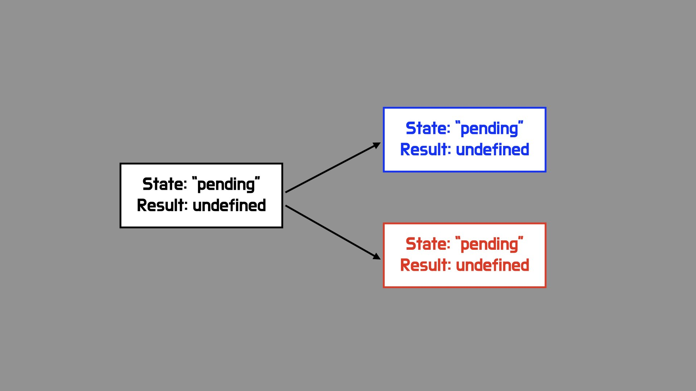

## 들어가며

Promise에서 자주 사용되는 용어인 resolve와 fulfill는 각각 완료와 이행으로 번역할수 있습니다. 의미상 완료와 이행이 거의 같다보니 처음 Promise를 학습할때 이를 동일한 의미를 가진 단어로 이해하기 쉽습니다. 하지만 이둘은 엄연히 다른 의미를 가지고 있습니다.

이번 포스트에서는 Promise의 기본 개념을 정리해보고, resolve와 fulfill의 차이점에 대해서 이해해봄으로써 Promise에 대한 이해도를 넓혀보고자합니다.

## promise의 세가지 상태


Promise는 세가지 상태를 가지고 있습니다. 이는 상호 배타적인 관계(두가지 상태를 가질수 없다는 의미입니다)를 가지며 아래와 같습니다.

- pending : 이행되지 않고 대기중인 상태
- rejected : 거절된 상태
- fulfilled : 값으로 이행된 상태

rejected, fulfilled 두가지 상태를 settled 라는 상태로 묶어서 부르기도 합니다.

## Promise 사용하기

우리가 promise를 사용할때 일반적으로 이러한 코드를 작성합니다.

```javascript
const promise = new Promise((resolve, reject) => {
  setTimeout(() => {
    resolve(1)
  }, 1000)
})
```

프로미스 객체를 생성할때 넣어주는 콜백함수는 두개의 함수를 인자로 받습니다. 이때 관례적으로 내부인자를 각각 resolve 와 reject라고 명시합니다. 실제로 프로미스를 구현한 polyfill을 살펴보아도 이 내부로 주는 함수의 이름이 resolve로 되어있습니다.

```javascript
// resolver가 바로 promise의 인자로 넣는 함수입니다.
resolver(
  function resolvePromise(value) {
    resolve(promise, value)
  },
  function rejectPromise(reason) {
    reject(promise, reason)
  }
)
```

분명 fulfilled과 rejected가 반대의 개념이기에 이자리에는 resolve라는 이상한 단어 대신 fulfill가 들어가야할것 같습니다. 이를 이해하기 위해 좀더 깊이 들어가 보겠습니다.

## resolve vs fulfilled

fulfilled는 promise의 이행된 상태입니다. 즉 작업이 끝나고 값으로 귀결이 된것이죠 그런데, resolve를 실행한다고 해서 반드시 값으로 귀결되지 않습니다. 아래 코드를 보겠습니다.

```javascript
const thenable = {
  // Could be a promise object, but does not have to be
  then(success, fail) {
    setTimeout(() => fail("실패했습니다!"), 1000)
  },
}

const p = new Promise((resolve, reject) => {
  console.log("1. pending 상태로 Promise가 생성됩니다")
  setTimeout(() => {
    resolve(thenable)
    console.log("2. thenable과 함께 resolve됩니다.")
  }, 1000)
})

p.catch(err => console.log(`3. "${err}" 에러메세지와 함께 reject됩니다.`))
```

처음에 resolve를 호출했지만, 여전히 promise는 끝난게아닙니다. resolve에 thenable 이 담겨 있는 경우 다시 해당 약속을 수행하게됩니다. 결과적으로 해당 thenable은 거절되기 때문에 이후 수행한 catch에서는 reject되었음을 알 수 있습니다.

따라서 resolve는 현재단계의 약속을 해결한것이지 값으로의 이행을 뜻하는 단어가 아닙니다. resolve함수를 사용하더라도 이후 프로미스 결과에 따라서 fulfill상태가 될 수도 있고, reject상태가 될 수 있기 때문입니다. 따라서 Promise 콜백의 첫번째 인자에는 fulfill 대신 resolve라는 단어가 들어가는것입니다.

## reject에 적용해보기

앞서 fulfill 대신 resolve라는 단어가 사용된 이유를 이해할수 있었습니다. 이러한 맥락에서 두번째 인자를 해석해보면, reject라는 상태와 관련된 용어가 사용되었으므로 이후 약속과 관계없이 무조건 rejected 상태로 이행되어야합니다. 앞선 코드를 살짝 바꾸어 위 이야기를 검증해보겠습니다.

```javascript
const thenable = {
  // Could be a promise object, but does not have to be
  then(success, fail) {
    setTimeout(() => success("성공!"), 1000)
  },
}

const p = new Promise((resolve, reject) => {
  console.log("1. pending 상태로 Promise가 생성됩니다")
  setTimeout(() => {
    reject(thenable)
    console.log("2. thenable과 함께 reject됩니다.")
  }, 1000)
})

p.catch(err => console.log(`3. "${err}" 에러메세지와 함께 reject됩니다.`))
```

실행해 보면 1,2,3 번 메시지가 모두 출력되는데, 2번과 3번이 동시에 출력됩니다. 즉, reject를 실행하게 되면 이후 thenable과 관계없이 그냥 catch로 이동후 거절된 상태가 됨을 확인할수 있습니다.

## 마치며

사실 이글을 작성하기 이전 까지만 하더라도 resolve와 fulfill을 같은 단어라고 생각했기 때문에 콜백의 resolve가 무조건 fulfilled상태를 만들어 준다고 생각했습니다. 그런데 reject는 상태 그대로 인자로 명시하면서 fulfill은 왜 resolve라는 다른이름으로 명시하는지 궁금해졌고 이를 찾아보는 과정에서 잘못 이해하고 있던 부분을 찾아 고칠수 있었습니다.

특히 언어를 개발하시는 분들이 네이밍에 얼마나 많은 노력을 기울이는지도 엿볼수 있는 좋은 기회였던것 같습니다.

추가적으로 공식 스펙에 적혀있는 fuilfill, reject, pending, resolve에 대한 글을 인용하면서 글을 마무리 하고자 합니다.

> A promise is resolved if it is settled or if it has been “locked in” to match the state of another promise. Attempting to resolve or reject a resolved promise has no effect. A promise is unresolved if it is not resolved. An unresolved promise is always in the pending state. A resolved promise may be pending, fulfilled or rejected.

## 참고자료

<a class="link" href="https://262.ecma-international.org/6.0/#sec-promise-objects">JS Promises: Fulfill vs Resolve</a>
<a class="link" href="https://javascript.plainenglish.io/javascript-promises-resolve-isnt-the-same-that-fulfill-3c6932a7a367">JavaScript promises: Resolve isn’t the same as Fulfil</a>
<a class="link" href="https://medium.com/@contact_97709/the-difference-between-fulfill-and-resolve-a-promise-f2cb5540cd6a">The difference between “fulfill” and “resolve” a Promise</a>
