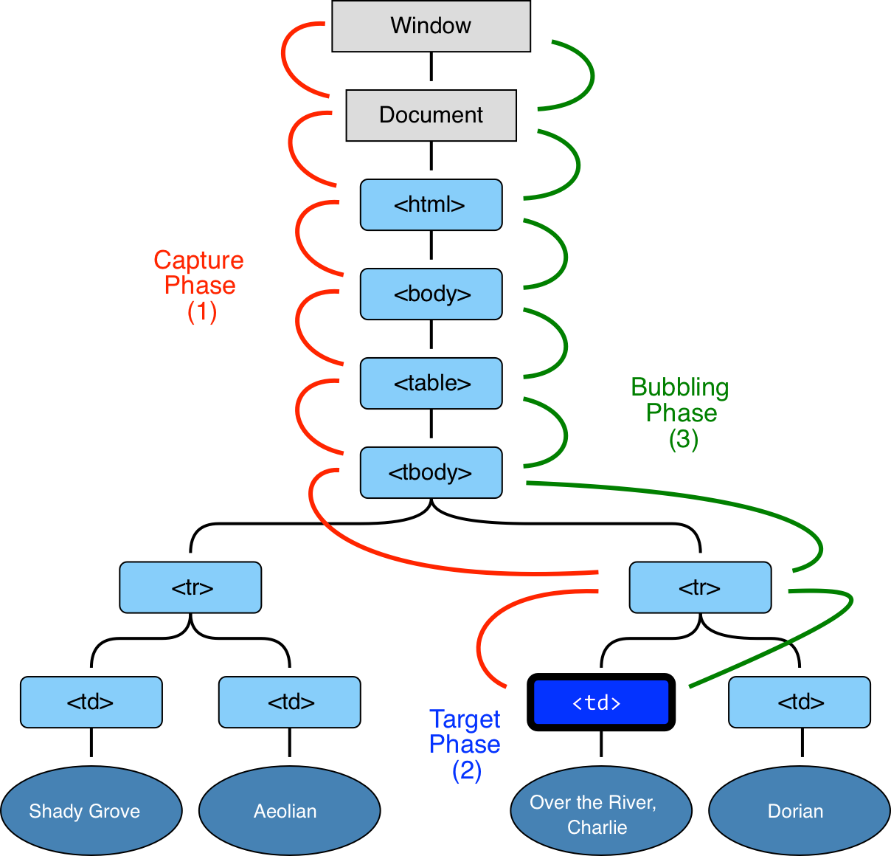
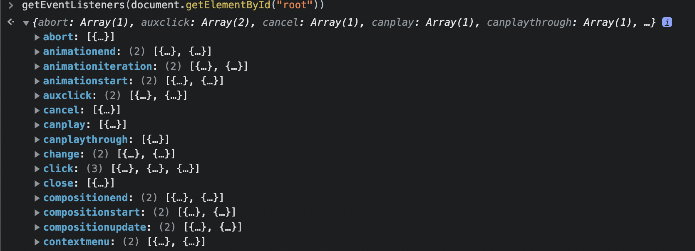

## 들어가며

React에서 작업을 하면서 이벤트를 핸들링할때 종종 예상과 다른 결과가 나올때가 있었습니다. 당시에는 구글링을 하여 문제만 해결하고 넘어갔는데 문득 이러한 결과가 React가 이벤트를 다루는 방식을 제대로 이해하지 못하여서 나오는 결과라는 생각이 들었습니다. 따라서 보다 깊이 있게 React가 어떻게 이벤트를 다루는지를 학습하였고, 이를 소개하고자합니다.

## 브라우저에서의 이벤트 전파 이해하기

브라우저에서의 이벤트 전파는 크게 세단계로 나뉘어집니다.


- 캡쳐 단계 : 위에서 아래로 전파
- 타겟 단계 : 요소에 도착
- 버블링 단계 : 아래에서 위로 전파

위 이미지 처럼 브라우저의 이벤트는 캡쳐단계 -> 타겟 단계 -> 버블링 단계로 진행됩니다. 즉 맨위에서 타겟 요소까지 내려왔다가 다시 맨위로 돌아가는것입니다. 이때 타겟단계는 캡쳐 혹은 버블링에 겹쳐서 진행되므로 신경쓰지 않아도 됩니다.

일반적으로 브라우저에서도 이벤트를 설정할때 기본값은 버블링입니다. 캡쳐단계는 버블링단계에 비해 ui적으로 일반적이지 않기때문에 거의 사용하지 않습니다. 보통 ui를 구성할때 큰요소를 부모로 두고 내부적으로 자식요소에 작은 요소를 두기때문에, 자식에서 부모로 올라도록 처리하는것이 보다 직관적이기 때문입니다.

이벤트 객체의 stopImmediatePropagation 메서드나 stopPropagation메서드를 이용하여
이벤트가 전파되는것을 막을수 있습니다. 다만 이는 추후 이벤트를 상위에서 받아들이지 못하도록 하기 때문에 아키텍처를 고려하여 꼭 필요한 곳에만 사용해야합니다.

## 일반적인 이벤트 처리방식

React를 이용하지 않고 자바스크립트를 이용하여 이벤트를 처리할때는 요소를 찾고 해당 요소에 이벤트 리스너를 직접 부착하는 방식으로 구현하였습니다. 간단하지만 코드로 구현하면 다음과 같습니다.

```javascript
<div id="target"></div>
<script>
  const doSomething = () => {
    console.log("doSomething");
  };
  document.querySelector("#target").addEventListener("click", doSomething);
</script>
```

## React에서의 이벤트

React에서 이벤트를 부착하는 과정과 실제 이벤트가 트리거되었을때의 과정 두가지를 살펴보면서 React의 이벤트를 설명하고자 합니다. 다만 이를 이해하기 위해서는 두가지 패턴을 먼저 이해해야하기에 이에대해먼저 설명한뒤 과정을 설명하겠습니다.

### SyntheticEvent 객체

보통 자바스크립트 이벤트 핸들러함수는 매개변수로 nativeEvent 객체를 받습니다. 하지만 React는 nativeEvent 객체를 그대로 사용하지 않고, SyntheticEvent 객체를 이용해서 nativeEvent 객체를 감싸는 방식을 사용합니다. 쉽게 설명하자면 NaviteEvent에는 브라우저 고유의 기능들만 있기때문에 여기에 모든 브라우저의 기능을 추가해준것이 SyntheticEvent 라고 생각하면 됩니다.

아래는 실제 React 코드 내부의 타입입니다. 브라우저 네이티브 이벤트도 있고, 실제 이벤트를 발생시킨 fibernode도 보관하고 있음을 알수 있습니다.

```javascript
type BaseSyntheticEvent = {
  isPersistent: () => boolean,
  isPropagationStopped: () => boolean,
  _dispatchInstances?: null | Array<Fiber | null> | Fiber,
  _dispatchListeners?: null | Array<Function> | Function,
  _targetInst: Fiber,
  nativeEvent: Event,
  target?: mixed,
  relatedTarget?: mixed,
  type: string,
  currentTarget: null | EventTarget,
}
```

### 이벤트 위임

React에서 등록한 이벤트는 해당 요소에 직접 등록되지 않고, 모두 document나 root 요소에 등록(해당부분은 아래에서 좀더 다루겠습니다)됩니다. 따라서 실제 우리가 요소에 onClick등의 프로퍼티에 명시를 하더라도 실제 등록되는것은 root 요소입니다. 크롬 브라우저에서 확인해보면 다음과 같습니다. 10개의 이벤트를 달았지만, 실제로 달려있는것은 1개의 이벤트입니다(그림에서는 3개로 표시되는데, 사실 2개는 React가 내부적으로 달아준것입니다.)

```javascript
function App() {
  return (
    <div>
      <ul>
        {new Array(10).fill(0).map((_, index) => {
          return (
            <li key={index} onClick={() => console.log(`요소${index}`)}>
              요소{1}
            </li>
          )
        })}
      </ul>
    </div>
  )
}
```




그런데 이를 좀더 자세히살펴보면, 실제 요소에도 이벤트 리스너가 달려있습니다. 이는 safari가 click 이벤트에 대해서 이벤트 전파를 지원하지 않기 때문에 요소에 직접 핸들러를 추가한것입니다. 다만 요소에 핸들러가 추가되어있음을 알리기만 하면 되기때문에 요소에는 noop 이라는 하나의 빈 함수가 추가되어있습니다.

그런데 이러한 이벤트 위임 패턴을 사용하는 이유가 무엇일까요? 여러가지 이유가 있지만, 가장큰 측면은 메모리 절약입니다. 모든 요소마다 핸들러를 개별로 부착하는것보다 상위 하나의 요소에만 부착하는것이 메모리를 절약할수 있기 때문입니다.

> React에서는 이벤트를 이미 위임해서 처리하므로 개발자가 이벤트 위임패턴을 사용하지 않아도됩니다. 아래링크는 실제로 성능차이가 없는지 직접 실험한 내용입니다.
> https://dev.to/thawsitt/should-i-use-event-delegation-in-react-nl0

### 이벤트 등록과정

**1.**&nbsp;click: 'onClick' 과 같은 형식으로 NativeEvent 이름과 React 이벤트 핸들러 Property를 매핑합니다. 이를 이용해 이벤트가 발생하면 적절한 프로퍼티와 연결할수 있습니다.

**2.**&nbsp;React에서는 정의한 이벤트 타입에 따라 부여하는 이벤트의 우선순위가 다른데, 전체 Native Event를 React에서 부여하는 기준에 맞게 우선순위를 설정합니다.

**3.**&nbsp;앞서 언급한 이벤트 위임을 활용하여 Virtual DOM에 이벤트 핸들러들을 등록합니다.

### 이벤트가 트리거되었을때

**1.**&nbsp;Button을 클릭하면 React에서 ‘click’ 이벤트를 감지하고, 부착되어있는 이벤트 리스너가 트리거됩니다. 이때, 이 이벤트 리스너는 React에서 정의한 dispatchEvent 함수를 호출하게 됩니다.

**2.**&nbsp;호출시 넘어온 이벤트 객체로부터 target DOM node(Button node)를 식별하며, 내부적으로 사용하는 키를 사용하여 이 DOM node가 어떤 Fiber node와 매칭되는지를 확인합니다

**3.**&nbsp;해당 Fiber node를 찾고 나면, 해당 node로부터 출발해서 root node에 이르기까지 Fiber Tree를 순회합니다. 이때 매칭되는 이벤트 Property(‘onClick’)와 매칭되는 이벤트를 가지는 Fiber Node를 발견할때 마다 이 이벤트 리스너(콘솔을 찍는 함수)들을 dispatchQueue 라고 불리는 Array에 저장합니다.

**4.**&nbsp;root node에 도착하고 나면, dispatchQueue라는 array에서 리스너를 꺼내어 실행합니다. queue이기 때문에 먼저 들어간 요소가 가장 먼저 실행되며 propagation 여부를 통과하지 못하는경우 나머지도 실행되지 않습니다.

## React 16버전과 17버전에서의 차이

현재 React 버전은 18버전이지만, 16버전에서 17버전으로 교체되는 과정에서 이벤트처리의 변경점을 이해하면 이벤트에대한 이해를 높일수 있을것 같아 다루어보고자합니다.

### root 요소와 document

React 17버전 부터는 점진적 업그레이드 라는 기능이 추가되었습니다. 이는 간단히 말하자면 하나의 프로젝트에 여러 React 버전을 사용할수 있도록 하는것입니다. 이는 다시 말하자면 html 에 여러개의 root 가 포함된 프로젝트가 존재할 수 있다는 이야기가 됩니다.

기존의 이벤트는 모두 document 요소에 위임되었기에, 여러개의 프로젝트가 동작할경우 버그가 발생할 가능성이 높았습니다. 따라서 점진적 업그레이드 기능을 뒷받침하기 위해 root요소에 이벤트를 위임하도록 변경하였습니다.


### event pool

앞서 언급한것 처럼 React 이벤트 핸들러의 객체는 native객체를 한번 래핑한 SyntheticEvent객체 입니다. 때문에 이벤트가 발생할때마다 native 객체를 SyntheticEvent객체로 래핑하면 너무 많은 객체가 필요할뿐아니라, 이후 GC가 메모리에서 해제하는 기능도 필요하므로 성능상 문제가 발생합니다.

이러한 현상을 해결하기 위한것이 event pool 입니다. event pool은 쉽게 말해서 Synthetic Event Instance 들이 들어있는 공간으로 이벤트가 발생하면 이를 사용한뒤 끝나면 바로 초기화 시키고 다시 풀로 돌려놓는것입니다.

하지만 event pool 은 핸들러 동작이 끝나면 곧바로 이벤트 객체를 초기화 하므로 비동기적인 동작은 실행되지 않습니다. 가령 핸들러 내부에 setTimeout 같은 코드가 있을경우 이벤트 객체를 받아 동작을 수행하려해도 객체가 비어있어 동작이 수행되지 않습니다. 따라서 e.persist()를 사용해 다른 메모리에 정보를 저장해 두어야 사용할수 있습니다.

```javascript
function App() {
  const handleClick = e => {
    console.log("초기화 전", { ...e })
    e.persist() // 이코드를 사용해야만 정상적으로 출력됩니다. 만약사용하지 않을경우 setTimeout 내부의 콘솔은 제대로 찍히지 않습니다.
    setTimeout(() => {
      console.log("초기화 후", e)
    }, 1000)
  }

  return (
    <div className="App">
      <h1>안녕하세요</h1>
      <button onClick={handleClick}>handleClick</button>
    </div>
  )
}
```

React 17버전에서 부터는 이러한 버그와 브라우저의 성능향상으로 인해 더이상 event pooling을 사용하지 않습니다. e.persist의 경우 사용하게되면 에러가 발생하는것은 아니고 아무런 기능을 하지 않습니다.

## 고민해보기

앞선 자료들을 잘 읽어보셨다면 React가 vanila javascript 처럼 이벤트를 등록하지 않는다는 사실을 알게되셨을것입니다. 그런데, dom 요소에 이벤트를 직접 바인딩하면 여러가지 예상할수 없는 상황이 발생합니다. 아래 코드에서 자식요소를 눌렀을때의 출력을 한번 생각해보시고 내려보시면 좋을것 같습니다.

```javascript
function App() {
  const ref = useRef(null)
  useEffect(() => {
    ref.current.addEventListener("click", () => console.log("부모 요소 클릭됨"))
  }, [])

  return (
    <div className="parents" ref={ref}>
      <div
        className="middle"
        onClick={e => {
          console.log("중간 요소 클릭됨")
        }}
      >
        <div
          onClick={e => {
            console.log("자식 요소 클릭됨")
            e.stopPropagation()
          }}
          className="children"
        ></div>
      </div>
    </div>
  )
}

export default App
```

정답은 부모 요소 클릭됨 -> 자식 요소 클릭됨 순으로 출력됩니다. 여기서 두가지 의문이 생길수 있습니다. 한가지는 stopPropagation 함수를 사용했음에도 중간요소는 출력되지 않는것과 달리 부모요소가 출력된점이고 다른 한가지는 부모요소가 출력되었는데 순서가 자식->부모가 아니라 부모->자식인 점입니다. 한가지씩 설명해보겠습니다.

순서가 역전된 이유는 이벤트 위임 때문입니다. React는 이벤트 위임을 사용해 root(혹은 document)에 등록하는데, 부모요소는 React가 관리하지 않으므로 그냥 단순히 요소에 등록되어있습니다. 따라서 이벤트 순서상 부모요소->root요소 이므로 부모요소가 먼저 출력되는것입니다.

stopPropagation 함수가 중간요소를 막고, 부모요소를 막지 못하는 이유는 각각 상이합니다. 먼저 부모요소를 막지 못하는것은 위와 유사하게 root요소가 되어야만 stopPropagation 함수가 동작하기 때문입니다. 다음으로 중간요소가 막히는 이유는 stopPropagation 함수는 래핑된 이벤트 객체의 함수이므로 내부적으로 React는 해당 함수의 실행여부를 바탕으로 React가 관리하는 요소들의 버블링여부는 결정해주기 때문입니다.

사실 이렇게 사용할 일이 있을까 싶지만, 이벤트를 직접 다루는 React 라이브러리를 사용하다보면 마주칠 수 있는 상황이기에 가급적 정확히 이해하고 있다면 이벤트를 다룰때 도움이 될것 같습니다.

## 마치며

지금까지 React에서 event를 바인딩하는 방식에 대해서 살펴보았습니다.

사실 이렇게 까지 알지 못해도 React에서 이벤트를 다루는데는 거의 문제가 없습니다. 17버전에서 달라진점은 18버전이 릴리즈된 시점에서 알아야 할필요가 없을수도 있습니다. 하지만 이 과정에서 React팀이 가진 철학과 고민을 이해할수 있는 만큼 한번쯤 짚고 넘어갈수 있었으면 좋겠습니다.

## 참고자료

<a class="link" href="https://blog.mathpresso.com/react-deep-dive-react-event-system-1-759523d90341">React Deep Dive— React Event System (1)</a>
<a class="link" href="https://blog.mathpresso.com/react-deep-dive-react-event-system-2-1d0ad028308b">React Deep Dive — React Event System (2)</a>
<a class="link" href="https://github.com/facebook/react/issues/13635">Event delegation in React</a>
<a class="link" href="https://fe-developers.kakaoent.com/2022/220908-react-event-and-browser-event/">React 이벤트와 브라우저 이벤트</a>
<a class="link" href="https://maddevs.io/blog/a-bit-about-event-delegation-in-react/#how-is-event-delegation-applied-in-react">How is event delegation applied in React?</a>
<a class="link" href="https://yamoo9.github.io/react-master/lecture/r-version-17.html#%E1%84%87%E1%85%B3%E1%84%85%E1%85%A1%E1%84%8B%E1%85%AE%E1%84%8C%E1%85%A5-%E1%84%8E%E1%85%AC%E1%84%8C%E1%85%A5%E1%86%A8%E1%84%92%E1%85%AA">이벤트 풀링(Pooling) 최적화 제거</a>
<a class="link" href="https://ko.javascript.info/event-delegation">이벤트 위임</a>
<a class="link" href="https://legacy.reactjs.org/blog/2020/10/20/react-v17.html#changes-to-event-delegation">Changes to Event Delegation</a>
