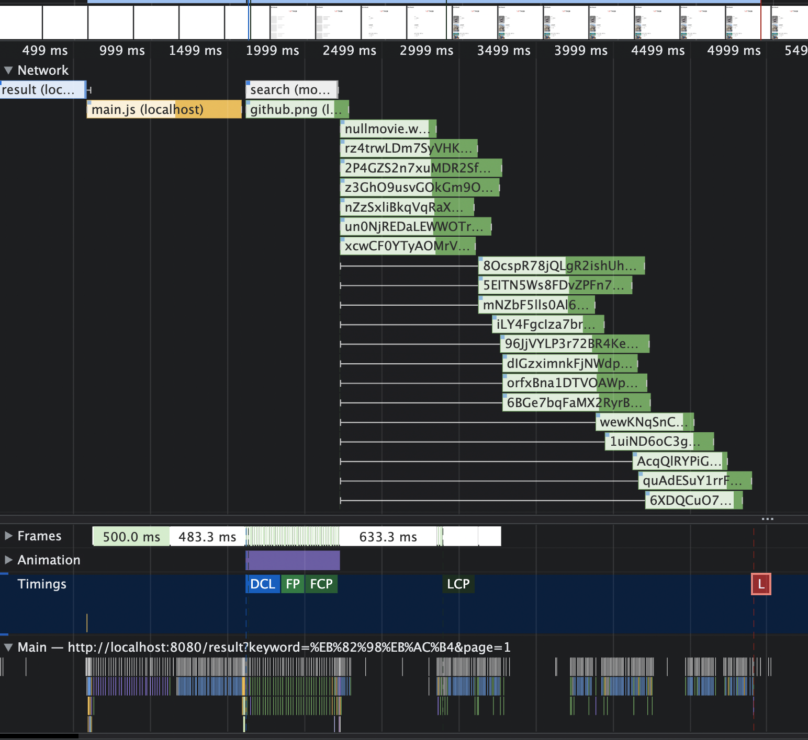
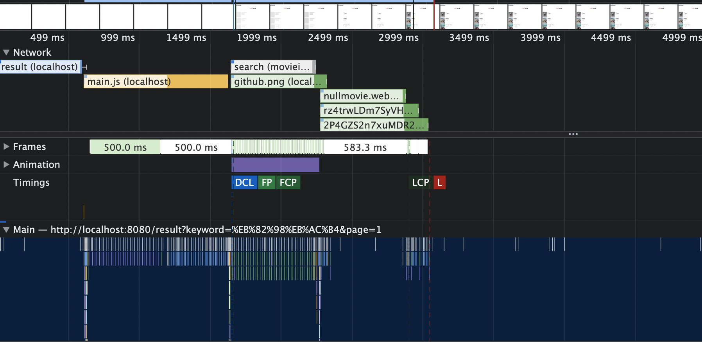

## 들어가며

페이지의 대부분이 사진으로 구성된 서비스(웹툰 서비스, 갤러리 서비스등)는 이미지를 최적화하는것이 곧 성능 최적화와 연결될때가 많습니다. 제가 진행한 프로젝트의 일부 페이지도 갤러리 서비스만큼은 아니지만 사진이 어느정도 있어서 lazy loading을 적용해 성능을 개선한 사례를 공유합니다.

## lazy loading 이란

문자 그대로 초기 로드시에 필요한 이미지만 로드하고, 아직 필요하지 않은 이미지들은 나중에 로드하는 방식입니다. 보통 처음 화면을 로드할때 보이는 이미지만 로드하도록 하고, 스크롤시 해당 이미지가 보였는지 여부를 확인해 추후 이미지를 로드하는 방식으로 구현됩니다.

## lazy loading 적용하기

lazay loading을 구현하는 방법은 다양합니다. img 태그에 속성을 명시함으로써 구현할수도 있고 스크롤 이벤트를 사용해 이미지가 보이는 특정위치에서 로드하게 구현할수도 있습니다. 하지만 여기서는 intersection observer를 통해 구현해보겠습니다. 성능적으로 신경써야하는 부분이 적고 일반적으로 자주 사용되는 api 이기 때문입니다.

```javascript
const options = {}
const callback = (entries, observer) => {
  entries.forEach(entry => {
    if (entry.isIntersecting) {
      entry.target.src = entry.target.dataset.src
      observer.unobserve(entry.target)
    }
  })
}
const observer = new IntersectionObserver(callback, options)
observer.observe(lookUp(`image${id}`))

// lazy loading이 적용된 이미지
;</img>
```

위 코드를 간략하게 설명하자면, img 태그의 src 속성을 통해 load 하지 않고, data 속성에 담아둡니다. intersection observer는 뷰포트와 요소가 겹치는 순간 loading 하고 재 loading을 막기위해서 구독을 해제합니다.

> intersection observer은 ie나 브라우저의 초기 버전에서는 동작하지 않습니다. 만약 코드가 동작하지 않는 다면 브라우저와 버전을 확인후 아래 링크에서 제한되어있는지 확인해주세요
> https://caniuse.com/intersectionobserver

### 실제 적용 결과



위 사진이 적용전이고 아래사진이 적용후 입니다. 빨간색 L로 표시된 부분이 로딩이 끝난 시점 즉 onload 이벤트가 발생한 시기입니다. 네트워크 상태에 따라 다르지만, 여러번 측정해본결과 약 2초정도의 차이가 발생하는것으로 확인됩니다. http 버전은 1.1입니다.

다만 domain sharding 기법을 사용하거나 http2를 사용하고 있었다면 위와 달리 많은 병렬요청을 한번에 할수 있기 때문에 위와같은 시간차이는 발생하지 않습니다. 그렇다면 이경우 lazy loading의 이점이 없다고 생각할수 있습니다. 하지만 시간차이만 발생하지 않을뿐, 불필요한 리소스를 받아오는 것이기에 네트워크 비용이 추가적으로 발생하게 됩니다. 따라서 이경우에는 네트워크 비용을 절약하였다고 생각하면 좋을것 같습니다.

## lazy loading 적절하게 사용하기

앞서 lazy loading 을 구현하고 이를 통해 초기 로드 시간을 개선한 사례를 확인하였습니다. 그렇다고 해서 모든 이미지에 lazy loading을 구현할 이유는 없습니다. 왜냐하면 이미지를 늦게 로드하면 초기 로드시간에는 긍정적일수 있지만, 결국은 이후 사용자가 페이지를 이용하면서 사용하기 때문에, 해당 과정에서 문제가 생길수 있기 때문입니다. 가령 이미지 사이즈가 큰경우, 미리 받아오지 않기 때문에 빈이미지를 볼수 있고, 디코딩이 오래걸려 메인스레드를 blocking해 브라우저가 먹통이 될수 있습니다.

물론 위 문제들도 이미지를 미리 로드하거나, 디코딩을 비동기적으로 처리하는 방식으로 해결할수는 있지만, 이야기 하고자하는것은 lazy loading을 적용해야할곳에 적절하게 사용해야한다는 사실입니다. 이미지제공이 메인인 갤러리 서비스에서는 이미지가 많기 때문에 lazy loading을 사용해 성능을 최적화 할수 있지만, 위키피디아와 같이 거의 텍스트 위주인 사이트에서는 굳이 lazy loading을 사용해도 초기로드시간을 거의 줄이지 못하면서 앞서 언급한 문제들이 나타날수도 있습니다.

따라서 lazy loading을 모든 이미지에 적용하면 안되며, 반드시 이로인해 성능개선이 발생한다는 사실을 기반으로 적용해야합니다.

## 마치며

lazy loading은 이미지 최적화를 할때 가장 많이 언급되는 방식입니다. 하지만, 구현할때 부터 고려할 필요는 없다고 생각합니다. 모든 최적화가 그렇듯이 최적화자체도 비용이 드는 행위이기 때문에, 일단 기능을 구현한뒤 이후 실제로 사이트가 느려지게되면 그때 이러한 최적화에대해서 고민하고 적용하는것이 더 좋은 방법이 아닐까 생각합니다.

## 참고자료

<a class="link" href="https://www.linkedin.com/pulse/why-does-your-browser-limit-number-concurrent-ishwar-rimal">Why does your browser limit the number of concurrent network calls?</a>
<a class="link" href="https://hackernoon.com/dont-be-lazy-3-problems-with-lazy-loading-and-when-to-use-eager-loading-qq1d34cl">Don’t Be Lazy: 3 Problems with Lazy Loading and When to Use Eager Loading</a>
