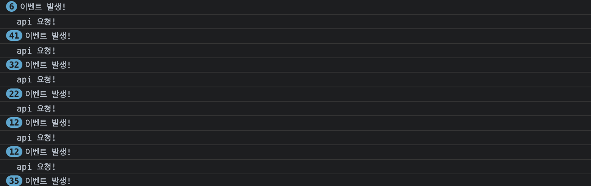
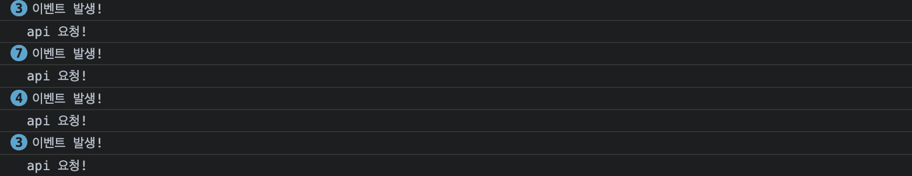
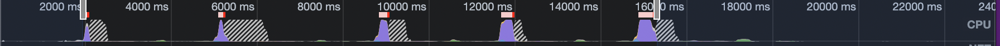

## 들어가며

최근 프로젝트를 리팩토링하면서 infinity scroll을 적용해야 하는 경우가 생겼습니다. react에서는 Infinity scroll을 지원하는 다양한 라이브러리가 있기에 이를 가져다 사용하면 되지만, 필요 이상으로 무거운 경우가 많고 동작원리를 이해하지못하고 사용하고있는것 같아서 직접 구현하여 적용해보았습니다.

## Infinity scroll 이란?

무한스크롤이라고 불리는 기법은 페이징의 한가지 종류입니다. 과거에 페이징을 처리하는 방식은 페이지네이션이라고 하여 하단에 페이지 번호를 기재하고, 해당 페이지를 클릭할때, 페이지에 해당하는 데이터를 보여주는 방식이었습니다. 하지만 모바일기기가 발달하면서 모바일환경에서는 페이지네이션 방식보다 무한스크롤 방식이 보다 몰입도를 높여준다고 생각하였고, 현재는 데스크탑 모바일환경에 국한되지 않고 사용되고 있습니다.

## 구현하기

구현에 앞서 무한스크롤은 서버의 데이터를 받아와야하기 때문에 데이터를 받아올수 있도록 서버 api를 mocking한 promise를 구현하였습니다. 아래 promise는 서버에서 지연되는것을 감안하여 약 1초간 기다렸다가 해당하는 페이지의 데이터를 내려보내줍니다. 간단하기 때문에 코드를 확인해보시면 좋을것 같습니다.

```javascript
const data = new Array(10000).fill(0).map((_, index) => ({
  id: index + 1,
  content: `안녕하세요${index + 1}`,
}))

export const fetchData = ({ page, size }) => {
  return new Promise(resolve => {
    const currentData = data.slice(size * (page - 1), size * page)
    const isLastPage = page * size <= data.length
    setTimeout(() => {
      resolve({ currentData, isLastPage, page })
    }, 5000)
  })
}
```

### scroll 이벤트 이용하기

가장 간단하게 무한 스크롤을 구현할수 있는 방식은 scroll이벤트를 이용하는것입니다. scroll이 움직일때마다 위치를 계산해서 끝에 도달했으면 로딩을 표시하고 새로운 컨텐츠를 가져오는것입니다.

가져오는 데이터가 너무작으면 스크롤이 이동하지 않아서 이벤트가 발생할수 없으므로 적절한 사이즈를 설정해야합니다. 예제에서는 30개 정도를 선택하였습니다.

```javascript
function App() {
  const [loading, setLoading] = useState(false)
  const [data, setData] = useState(null)
  const loading = useRef(false)
  useEffect(() => {
    fetchData({ page: 1, size: 30 }).then(res => setData(res))
  }, [])

  useEffect(() => {
    const handleScroll = () => {
      const { scrollTop, offsetHeight } = document.documentElement
      console.log("이벤트 발생!")
      if (
        window.innerHeight + Math.ceil(scrollTop) >= offsetHeight &&
        !api.current
      ) {
        console.log("api 요청!")
        setLoading(true)
        api.current = true
      }
    }
    window.addEventListener("scroll", handleScroll)
    return () => window.removeEventListener("scroll", handleScroll)
  }, [])

  useEffect(() => {
    if (loading && data !== null && !data.isLastPage) {
      fetchData({ page: data.page + 1, size: 30 }).then(res => {
        setData({
          ...res,
          currentData: data.currentData.concat(res.currentData),
        })
        setLoading(false)
        api.current = false
      })
    } else {
    }
  }, [loading, data])

  if (data === null) {
    return <div>초기 로딩중...</div>
  } else {
    return (
      <div>
        {data.currentData.map(({ id, content }) => {
          return (
            <div>
              <div>{id}</div>
              <div>{content}</div>
            </div>
          )
        })}
        {loading ? <div>추가컨텐츠 로딩중...</div> : null}
      </div>
    )
  }
}
```

여기서 약간의 설명이 필요한 부분은 왜 loading을 useState 와 ref 모두에서 처리하느냐는것입니다. 일반적으로 생각하면 useState의 상태에서 처리하는것이 맞습니다. 하지만, 이렇게 처리하게되면 scroll event의 핸들러 함수내부에서는 값을 state의 최신값을 참조할수가 없습니다. 따라서 ref를 추가적으로 두어서 최신의 loading상태를 참고하고자 하였습니다.

여기서 조금더 이야기를 해보자면 ref만을 사용하면 안되냐고 이야기할수 있습니다. 이렇게 사용하게되면 리렌더링이 안일어나서 아래 data fetch를 담당하는 useEffect가 발생하지 않습니다. 그러면 아예 해당로직을 핸들러로 넣으면 안되냐고 이야기할수 있습니다. 이경우도 위와 비슷한 상황이 발생하는데, 이벤트 핸들러 내부에서 state는 최신값이 아니기 때문에 결국 setData에서 값을 가져오는 로직이 필요하고 이 로직이 더 복잡하겠다고 생각하여 이러한 형식으로 구성하였습니다.

#### Throttle를 이용하여 최적화하기

이 코드는 정상적으로 잘동작하지만, 이벤트 리스너가 너무 자주 작동한다는 문제가 있습니다. 실제로 위 코드를 적절한 속도로 스크롤하면서 동작시킨 결과는 다음과 같습니다.

이벤트가 많이 동작하게되면 scrollTop offsetHeight을 자주 계산하게 되는데, 이때마다 브라우저가 리플로우를 일으키기 때문에 문제가 됩니다. 따라서 이를 해결하기 위해서 특정시간에 한번만 요청을 보낼수 있도록 throttle을 이용합니다 lodash 같은 라이브러리의 throttle을 사용할수도 있지만, 이번포스트에서는 직접 구현하는것을 목표로 하고있으니 직접 구현해보겠습니다.

```javascript
export const Throttle = (callback, time) => {
  let timer;
  return () => {
    if (!timer) {
      timer = setTimeout(function () {
        timer = null;
        callback();
      }, time);
    }
  };
};

// App.js에서 사용 할때
...
const throttleHandler = Throttle(handleScroll, 200);
window.addEventListener("scroll", throttleHandler);
return () => window.removeEventListener("scroll", throttleHandler);
...
```

쓰로틀링을 실행하기를 원하는 콜백함수와 지연시간을 인자로 받고, 함수를 리턴합니다. 이함수를 실행할때, 콜백함수는 매번 실행되지 않고, 지연시간동안 한번만 실행되도록 timer가 실행중이면 콜백이 실행되지 않도록 하는 코드입니다. 이코드를 통해 개선된 로그는 다음과 같습니다


> lodash 라이브러리의 throttle에는 설정값이 넘어오지 않으면 requestAnimationFrame(이하 raf)를 사용합니다. 그래서 여기에 왜raf를 적용하지 않는지 의문이 드실수 있습니다. 이는 스크롤 이벤트가 렌더링 할때마다 호출되므로 raf가 기본적으로 적용되어있다고 볼 수 있기때문입니다. 따라서 여기에 raf를 적용하는것은 큰의미가 없습니다. 다만 스크롤 이벤트에 raf를 적용해야하는 경우가 있습니다. 더 자세한 내용은 아래 포스트를 참고해보시면 좋을것 같습니다.
> <a class="link" href="https://yrnana.dev/post/2021-08-09-scroll-event-raf-throttle/">scroll event에 rAF throttle을 적용해야할까</a>

### Intersection Observer API

위의 스크롤 이벤트에 throttle을 걸고 rAF를 사용하는 복잡한 방식 대신 intersection Observer라는 api를 사용하면 더욱 쉽게 위 효과들을 구현할수 있습니다. 비동기적으로 실행되기 때문에 메인 스레드에 영향을 주지 않으면서 변경 사항을 관찰할 수 있습니다. 왜냐하면 일단 비동기적으로 실행되고, 앞서 크기를 구하기 위한 과정에서 발생하는 리플로우 현상을 발생시키지 않고, 지점에 도달했음을 알아낼수 있기 때문입니다.

```javascript
export const useIntersectionObserver = (fetchData, loading) => {
  const lastContentRef = useRef(null)
  useEffect(() => {
    if (lastContentRef.current !== null) {
      const options = {}
      const callback = (entries, observer) => {
        entries.forEach(entry => {
          if (entry.isIntersecting && !loading) {
            console.log(1)
            observer.unobserve(entry.target)
            fetchData()
          }
        })
      }
      const observer = new IntersectionObserver(callback, options)
      observer.observe(lastContentRef.current)
      return () => observer.disconnect()
    }
  })
  return lastContentRef
}
```

기본적인 아이디어는 마지막 컨텐츠에 옵저버를 붙이고 관찰하게 하여 마지막 컨텐츠가 보이면 추가 컨텐츠를 불러오는것입니다. 이를 위해서 매 렌더링 마다 새로운 마지막 컨텐츠의 dom에 옵저버를 새롭게 부착하도록 하였고, 교차할때 페이지를 불러오는 함수를 실행하도록 하였습니다.

여기서 loading이라는 인자가 필요한 이유는 fetchData 함수를 실행하면 loading 이 true로 변경되면서 더이상 호출이 되지 않아야 하는데, 이 변경사항이 리렌더링을 일으키므로 로딩중에는 요소가 추가된것이 아니므로 감지하지 않도록 하기위해 추가하였습니다.

> intersection observer는 option에 여러 값을 넣을수 있고, callback의 인자인 observer 등에서도 추가적으로 적용할수 있는 효과가 있습니다. 구체적인 방식이 궁금하신분은 아래 포스트를 참고해보시면 좋을것 같습니다. https://heropy.blog/2019/10/27/intersection-observer/

## Virtual scroll 이용해보기

앞서 소개한 Intersection observer를 사용하면 요소의 갯수가 많지 않을때에는 잘동작하는 무한스크롤을 구현할수 있습니다. 하지만 10000개의 요소가 추가될경우 화면에 보여지는 요소는 20개 안팎이겠지만, 브라우저가 dom에 유지하고 있는 요소는 10000개 이므로 렌더링 성능에 악영향을 줍니다. 실제 렌더링 성능을 보면 보라색 영역이 레이아웃을 담당하는 영역인데, 대략 60ms 씩 선형적으로 증가합니다. 

이를 해결하는 방법은 가상화 입니다. 실제로 화면에 보이는 dom요소만 렌더링 하는것입니다. react에서는 react-virtualized, react-window 라는 라이브러리를 사용해 이를 구현할수 있습니다. 하지만 이해를 높이는것이 목적이므로 라이브러리를 사용하지 않고 구현해보겠습니다. 다만 정확하게 구현하면 따져야하는경우가 많기 때문에 최대한 간단하게 구현해보도록하겠습니다.

### 직접 구현해보기

가상화의 핵심 아이디어는, 렌더링해야하는 전체 크기 만큼의 빈 컨테이너 박스를 만들어두고, 실제 뷰포트 만큼의 또다른 박스를 만들어서 스크롤 위치가 변하면 해당 박스를 이동하고, 컨텐츠도 변경해주는것 입니다.

박스를 이동하는것은 스크롤이벤트를 이용하면되는데, 마지막요소인지를 검사하는것은 스크롤 이벤트만으로는 어렵습니다. 예를 들어 마지막 요소가 보이기 시작할때 요청을 한다고 가정하면, 초기 스크롤이 요소보다 크게 되면 요청이 이루어지지 않습니다. 따라서 이를 위해 list의 마지막에 가상요소를 absolute로 두고 intersection observer를 통해 감시하도록 하여 요소가 보일때 요청하면됩니다.

```javascript
import "./App.css"
import { useEffect, useRef, useState } from "react"
import { fetchData } from "./dataFetch"

function App() {
  const [loading, setLoading] = useState(true)
  const [startNode, setStartNode] = useState(0)
  const [data, setData] = useState({
    currentData: [],
    isLastPage: false,
    page: 0,
  })
  const [page, setPage] = useState(1)
  const visibleNodesCount = Math.ceil(500 / 110) + 1
  const containerRef = useRef(null)
  const visibleRef = useRef(null)
  const checkBoxRef = useRef(null)
  const wrapRef = useRef(null)
  const timer = useRef()
  // 여기서 페칭은 처음 요청이 아닌 스크롤로인한 두번째 이상의 요청을 의미합니다.
  const fetchRef = useRef(false)

  //페이지 변경시 api를 호출하는 함수입니다.
  useEffect(() => {
    // 처음 요청하는것이 아닐경우 페칭을 위한 높이 추가 및 페칭을 활성화합니다.
    if (data.currentData.length !== 0) {
      fetchRef.current = true
      wrapRef.current.style.height = `${110 * (page - 1) * 10 + 50}px`
    }
    fetchData({ page, size: 10 }).then(res => {
      setData(prev => {
        const a = {
          ...res,
          currentData: [...prev.currentData, ...res.currentData],
        }
        return a
      })
      setLoading(false)
      fetchRef.current = false
      if (wrapRef.current !== null) {
        // 마지막요소일경우를 감안하여 리스트의 총 높이를 정해줍니다.
        wrapRef.current.style.height = `${
          110 * ((page - 1) * 10 + res.currentData.length)
        }px`
      }
    })
  }, [page])

  //스크롤을 이동하여 가상요소를 결정하게 해주는 이펙트입니다.
  useEffect(() => {
    if (!loading) {
      const virtualInfinityScroll = () => {
        // 스크롤 이벤트에 디바운스가 적용되어있습니다.
        if (!timer.current) {
          timer.current = setTimeout(() => {
            const scroll = containerRef.current.scrollTop
            const startNode = Math.floor(scroll / 110)
            setStartNode(startNode)
            timer.current = undefined
          }, 50)
        }
      }

      if (containerRef.current !== null) {
        containerRef.current.addEventListener("scroll", virtualInfinityScroll)
      }
    }
  }, [loading])

  //위 이펙트와 같이 사용되는것으로 깜빡거림을 방지하기위해 startNode로 요소가 변경된후 이동하도록 처리하였습니다.
  useEffect(() => {
    if (visibleRef.current !== null) {
      const offsetY = startNode * 110
      visibleRef.current.style.transform = `translateY(${offsetY}px)`
    }
  }, [startNode])

  // intersecionObserver를 이용하여 마지막요소임을 감지하는 로직입니다.
  useEffect(() => {
    if (!loading) {
      const options = { root: containerRef.current }
      const callback = (entries, observer) => {
        entries.forEach(entry => {
          if (entry.isIntersecting) {
            // 페칭 중일때는 요청하지 않습니다. 가령 위로 올렸다가 다시 로딩으로 진입할경우를 차단합니다.
            if (!fetchRef.current) {
              setPage(page => {
                return page + 1
              })
              fetchRef.current = true
            }

            // 데이터가 마지막 데이터일 경우 옵저버를 해제합니다.
            setData(data => {
              if (data.isLastPage) {
                observer.unobserve(entry.target)
              }
              return data
            })
          }
        })
      }
      const observer = new IntersectionObserver(callback, options)
      observer.observe(checkBoxRef.current)
    }
  }, [loading])

  if (loading) {
    return <div>초기 로딩중...</div>
  } else {
    return (
      <div className="root">
        <div className="container" ref={containerRef}>
          <div className="wrap" ref={wrapRef}>
            <div className="visible" ref={visibleRef}>
              {data.currentData
                .slice(startNode, startNode + visibleNodesCount)
                .map(({ id, content }) => {
                  return (
                    <div key={id} className={`item ${colors[(id - 1) % 7]}`}>
                      <div>{id}</div>
                      <div>{content}</div>
                    </div>
                  )
                })}
              {fetchRef.current ? (
                <div className="reviewListLoading" key={"loading"}>
                  로딩중....
                </div>
              ) : null}
            </div>
            <div className="checkbox" ref={checkBoxRef} key={"checkbox"}></div>
          </div>
        </div>
      </div>
    )
  }
}

export default App

const colors = ["red", "orange", "yellow", "green", "blue", "navy", "purple"]
// css는 생략하였습니다.
```

## 마치며

이번 포스트에서는 무한스크롤을 직접 구현해보고 이를 단계별로 최적화해보았습니다. 실전에서는 라이브러리를 적절하게 사용하는것이 당연히 좋지만, 직접 구현해보면서 원리를 이해하고나면 더욱 잘 사용할수 있을것 이라 생각합니다.

## 참고자료

<a class="link" href="https://tech.kakaoenterprise.com/149">실전 Infinite Scroll with React</a>
<a class="link" href="https://www.zerocho.com/category/JavaScript/post/59a8e9cb15ac0000182794fa">쓰로틀링과 디바운싱</a>
<a class="link" href="https://velog.io/@0715yk/HTML-requestAnimationFrame">[HTML] requestAnimationFrame</a>
<a class="link" href="http://blog.hyeyoonjung.com/2019/01/09/intersectionobserver-tutorial/">Intersection Observer API의 사용법과 활용방법</a>
<a class="link" href="https://dev.to/adamklein/build-your-own-virtual-scroll-part-i-11ib">Build your Own Virtual Scroll - Part I</a>
