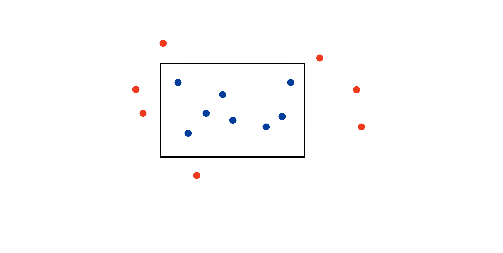
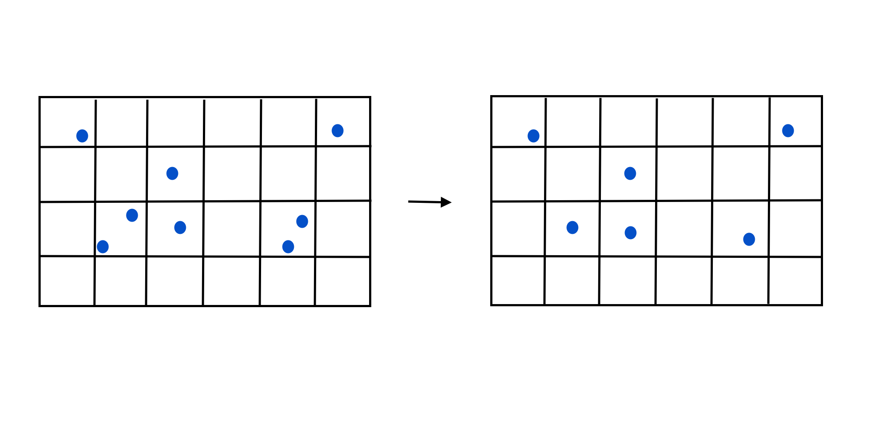
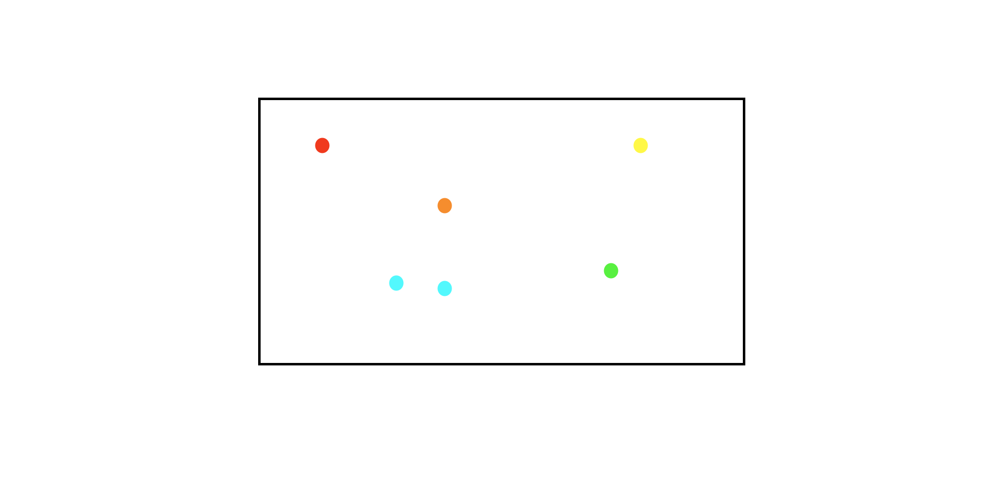
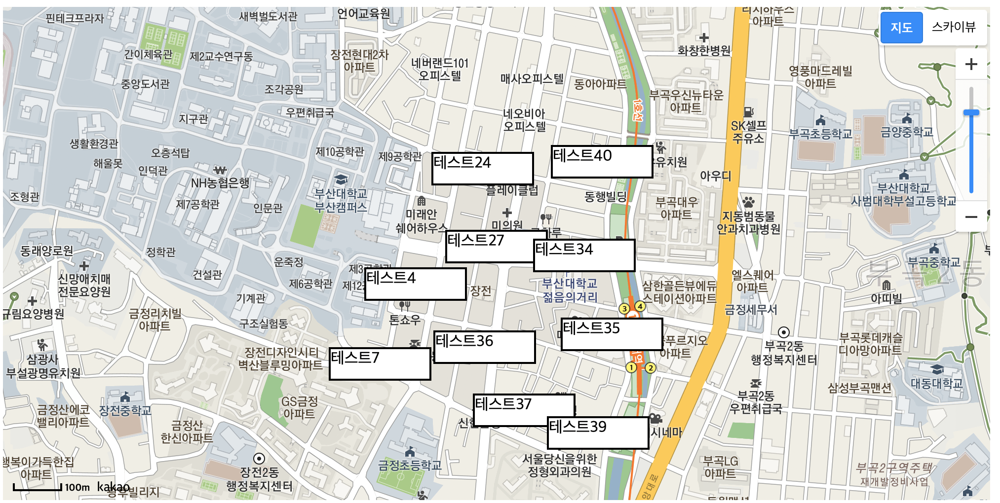

## 들어가며

이번 포스트에서는 지도기반 의 프로젝트를 진행하면서 지도를 축소할때 오버레이 또는 마커가 겹치는 현상을 해결하기 위하여 시도한 방법과 이를 오픈소스 형태로 배포하면서 겪은 이슈와 느낀점을 이야기합니다.

## 문제상황

지도 기반의 장소찾기 프로젝트를 만들어 배포한뒤 테스트를 진행하던 도중 지도를 축소하면 오버레이가 겹치는 현상을 발견했습니다. 현재는 요소가 많지 않아서 괜찮지만 요소가 매우 많아지면 렌더링성능에 악영향을 줄뿐만아니라 요소가 겹쳐서 클릭을 할수 없어 기능적으로 문제가 있었습니다. 따라서 이를 클러스터링을 이용해 개선하고자하였습니다.

다행히 사용하고있는 kakao map api에서 클러스터링을 제공해서 이를 사용하려 하였는데 문제가 있었습니다. 제가 원하는것은 <a class="link nodisplay" href="https://map.naver.com/v5">네이버지도</a>처럼 클러스터의 대표데이터를 오버레이로 표시하고, 해당 오버레이를 클릭하면 군집의 데이터리스트를 보여줄수 있도록 하는것이었습니다. 이를위해서는 클러스터의 상세 데이터가 필요했는데, kakao map api는 클러스터의 갯수 이외의 데이터를 제공해 주지 않았습니다. <a class="link nodisplay" href="https://devtalk.kakao.com/">devtalk</a> 의 질문들을 살펴보니 저와 유사한 상황들이 있었고 답변을 정리해본결과 직접 클러스터링을 구현하는것이 좋다고 생각하였습니다.

## 클러스터링 구현하기

클러스터링을 직접 구현할때 참고할만한 자료가 있으면 좋을것같아 찾다보니 안드로이드 기반의 지도 클러스터링을 구현한 라이브러리가 있었고 해당 라이브러리에서 사용한 클러스터링 알고리즘의 레퍼런스를 찾을수 있었습니다. 이 레퍼런스는 구글 지도가 클러스터링을 구현할때 사용한 방식인데, 대부분 그대로 사용하면서 일부만 바꿔서 사용하였습니다. 구현한 함수는 총 세가지로 이 세가지 절차를 거쳐서 클러스터링이 이루어집니다.

### 지도 내부에 있는 요소를 판별하기

가장 간단한 함수로 렌더링된 지도의 위도 경도 좌표를 받아서 내부에 위치한 요소만 렌더링할수있도록 필터링 하는 함수입니다. filter함수를 사용하여 구현하였습니다.

### Grid-Based Filtering

격자 기반 필터링 이라고 말할수 있는 방식입니다. 사각형 모양의 지도에 줄을 그어서 구역을 나누고, 이 구역내에서 순위가 높은 n개 요소만 남기는 방식입니다. 저는 이후 클러스터링 된 데이터를 합칠때 어려움이 있을것 같아 1개만 남기도록 하여 구현하였습니다. 이때 격자마다 요소의 평균을 구해 이후 알고리즘에서 참고할수있도록 하였습니다.

### DBSCAN 알고리즘

DBSCAN이라고 불리는 군집 알고리즘입니다. 클러스터의 반경, 클러스터의 개체 최소값을 미리 지정한뒤, 이에 해당하는 요소를 하나의 군집으로 처리하는것입니다. 쉽게 설명하자면 아래 단계를 반복합니다.

1. 임의의 요소를 선택합니다
2. 군집으로 포함되지 않은 다른 모든 요소를 검사해 반지름내에있는 이웃인지 확인합니다
3. 이웃일 경우 군집으로 포함시키고 해당 요소에 대해서 다시 검사를 시작합니다.
4. 이웃이 남아있지 않은경우 다시 1~3번 과정을 반복합니다.

이전에 한번 클러스터링을 했음에도 이과정이 필요한 이유는 격자기반 필터링을 할때, 중심 좌표를 격자 내부 요소의 평균점으로 구했기 때문입니다. 경우에따라서 모서리에 모이면 겹칠수 있기 때문에 이 알고리즘을 수행하도록 처리하였습니다.

## npm 을 이용해 배포하기

만든 알고리즘을 프로젝트 내부에서 사용하는 방법도 있었지만, 이러한 형태의 라이브러리를 github에서 찾아봐도 없었기에, 혹시 나와 똑같은 상황에 처한사람에게 해결책이 될수 있도록 npm을 이용해 오픈소스로 배포하고자 하였습니다.

npm에 가입하고 이를 배포하는과정은 큰문제가 없었는데, 이를 배포하기위해 라이브러리를 빌드하는 과정에서 이슈가 많았습니다. 아래에서는 빌드과정에서의 이슈에 대해서 소개합니다.

### webpack 라이브러리 전용으로 빌드하기

webpack은 react와 같은 애플리케이션을 빌드할때 사용해보았기에 이와 동일하게 설정하면 된다고 생각하였습니다. 하지만 애플리케이션과 달리 라이브러리의경우 사용할 함수를 제공하는 형태이기에 이런경우 webpack은 기본적으로 모든 코드를 삭제하게되어 번들링하면 빈파일이 나옵니다. 처음에는 웹팩에 오류가 있는줄 알았는데, 찾아보니 libaray를 설정할수 있는 코드가 있었고 이를 표기해서 해결할수 있었습니다.

### cjs 와 esm 모듈 지원하기

제가 만든 라이브러리는 요소의 갯수가 작으면 클라이언트에서 사용해도되지만, 그렇지 않은경우 서버에서 클러스터링을 진행하고 데이터를 내려주는것이 더 좋습니다. 따라서 cjs 와 esm 모두 지원하고자 처음에는 번들링을 두가지 방식으로 진행한뒤, package.json의 main, module 속성각각에 cjs, esm 파일을 명시하였는데, 원하는 대로 동작하지 않았습니다. 따라서 추가적으로 exports 의 default 속성에 cjs파일을 추가하였고, 자료를 찾다보니 default exports만 계획하고있다면 cjs 만으로 esm 까지 커버할수 있다는 자료를 읽고 cjs 파일만 배포하도록 수정하였습니다.

### type.d.ts 타입 제공하기

타입스크립트로 작성하지는 않았지만, 외부로 제공하는 clustering 함수에 대한 타입정의는 필요할것 같아 해당파일을 제공하려하였습니다. 처음에는 type.d.ts를 단지 작성해 빌드 결과물에 포함만 시키면 될것 같았는데, 타입을 추론하지못해서 package.json 파일에 types 속성을 부여하여 해결할수 있었습니다.

### npmignore vs files

npm에 배포할때 모든 파일을 배포할필요는 없어서 빌드 파일과 readme 정도만 제공하고자 하였습니다. 찾아보니 이를 지원하기 위해서는 두가지 방법이 있었습니다. gitignore 처럼 npmignore을 설정해 제외하는 방식과 포함할 파일을 명시하는 files를 명시하는 방식입니다. 빌드 결과물에 포함시킬 파일갯수가 몇개 되지 않고, 빌드파일만 files 속성에 표기하면 기본적으로 포함되는 파일(readme,package.json등)은 포함되기 때문에 files 속성을 사용하였습니다. 또한 npm이 npmignore로인해 gitignore 파일을 대체할수 있어 일부 파일을 유출할 문제가 있기 때문에 files 속성을 권장하는 포스트도 결정에 영향을 주었습니다.

## 지도에 적용해보기

배포된 npm 패키지를 이용해서 프론트엔드에 적용시켰습니다. 단순하게 요소를 클릭할때 1개이면 해당 정보를 그대로 옆에 보여주고, 2개이상인경우 리스트를 보여주고 리스트를 클릭하면 요소의 정보를 볼수 있도록 하였습니다. 아래 이미지를 보면 확실히 썸네일보다는 줄어든것을 확인할수 있습니다.

## 마치며

클러스터링을 직접 구현하기위해서 알고리즘을 이해하는것 자체에는 큰 어려움이 없었지만, 이를 구현된 프로젝트에 적절하게 사용하기위해 많은 고민을 한것 같습니다.

또한 오픈소스로 배포하기위해서 axios, redux, react와 같은 유명한 node.js 라이브러리의 폴더 구조나 package.json, webpack.config등 설정파일을 많이 참고하였는데 이과정에서 좋은 폴더 구조를 많이 배울수 있었습니다.

한가지 바램이라면 1명이라도 라이브러리를 사용하여 개발 과정에서의 문제를 해결하는것입니다. 지금당장은 어렵더라도 꾸준히 프로젝트를 개선하여 1명의 라이브러리 사용자를 만들기 위해 노력하고자합니다.

> 네이버나 카카오 지도에서 클러스터링을 커스텀해서 사용해보고 싶은신분은 제 라이브러리를 한번 이용해보세요! 아래는 라이브러리 저장소링크 입니다
> https://github.com/puki4416/map-cluster

## 참고자료

<a class="link" href="https://heropy.blog/2019/01/31/node-js-npm-module-publish/">내 NPM 패키지(모듈) 배포하기</a>
<a class="link" href="https://toss.tech/article/commonjs-esm-exports-field">CommonJS와 ESM에 모두 대응하는 라이브러리 개발하기: exports field</a>
<a class="link" href="https://webpack.kr/configuration/output/">Output | webpack
<a class="link" href="https://medium.com/@jdxcode/for-the-love-of-god-dont-use-npmignore-f93c08909d8d">For the love of god, don’t use .npmignore</a>
<a class="link" href="https://velog.io/@0715yk/HTML-requestAnimationFrame">[HTML] requestAnimationFrame</a>
<a class="link" href="https://devtalk.kakao.com/t/topic/109849">대량 좌표의 클러스터 처리 관련 문의드립니다-지도/로컬API-카카오 데브톡</a>
<a class="link" href="https://devtalk.kakao.com/t/topic/40110">클러스터러 대용량 데이터 효율적으로 표시할수 있는 방법이 있을까요-지도/로컬API-카카오 데브톡</a>
