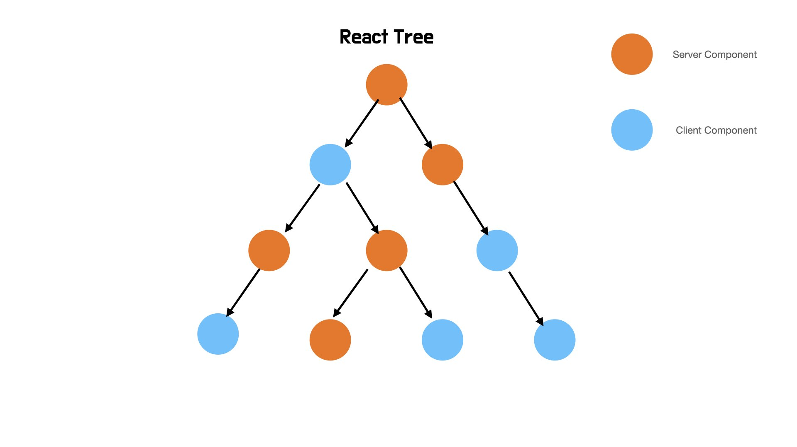

## 들어가며

Next.js 13 버전부터 기존에 이용하던 page 폴더대신 app 폴더를 사용하여 routing을 하도록 변경되었습니다. 폴더이름만 변경된것이 아니라 내부적으로 파일기반 routing에서 폴더기반 routing으로 변경되거나, layout, loading, error 파일을 만들어 보다 추가적인 기능을 routing과 함께 사용할수 있게 되었습니다.

하지만 app폴더를 사용함에 있어서 가장 중요한 내용은 모든 컴포넌트가 React Server Component(이하 RSC)라는점입니다. 따라서 이번 포스트에서는 RSC 에 대해서 알아보고, Next.js에서 RSC를 이용해 어떤방식으로 data patching을 할 수 있는지 살펴보겠습니다. 마지막으로 기존에 사용되던 SSR과는 어떠한 차이가 있는지 간단하게 다루어보겠습니다.

> 이 포스트는 server component 이외의 구체적인 routing 방법이나 13버전의 다른 기능은 다루지 않습니다.

## RSC 이해하기



### 개요

현재에도 사용하지만, 과거에 웹개발시 많이 사용되던 PHP라는 언어가 있었습니다. 기존의 정적인 html만을 전송하는 것으로는 요구사항을 만족시키기 어려워서 서버사이드에서 html을 동적으로 생성하여 주는 언어였습니다. 하지만 이러한 개발방식은 ajax, jquery, react와 같은 도구로 인해서 점점 서버에서 html을 만들지 않고, 자바스크립트를 브라우저에서 해석하여 html을 수정하는 방식으로 변화하였습니다.

물론 이러한 방식으로 클라이언트 측에서 보다 원활하게 동작하는 어플리케이션을 만들게 되었지만, 백엔드 의존적인 작업을 원활하게 수행할 수 없다는 단점이 존재했습니다. 모든 작업을 클라이언트로 옮겼기 때문입니다. 이러한 배경에서 등장한것이 RSC입니다. RSC는 기존의 php처럼 페이지를 새로 고치지 않고 클라이언트에 존재하는 React Tree와 결합할 수 있기 때문에 UI를 유지하면서(사용자가 입력한 값등) 백엔드 의존적인 작업을 원활하게 수행할수 있도록 해줍니다.

또한 컴포넌트 단위로 동작하므로 서버컴포넌트는 위 이미지 처럼 자유롭게 클라이언트 컴포넌트와 결합하여 동작하며 만약 서버컴포넌트가 필요한경우 서버에서 실행한 결과를 유사 json형태로 받아옵니다.


### 예제코드

간단한 코드를 통해 서버컴포넌트의 동작을 이해해보겠습니다. 앞서 말씀드린것처럼 app 폴더이하의 모든 컴포넌트는 기본적으로 서버 컴포넌트이며 만약 기존의 방식대로 클라이언트 컴포넌트를 사용하고자 한다면 'use client'라는 지시문을 최상단에 기재하면 됩니다.

#### 서버 컴포넌트

```javascript
// app/page.js

export default function Server() {
  console.log("서버에서만 렌더링됩니다.")
  return (
    <div>
      <h1>서버 컴포넌트</h1>
      <p>서버 컴포넌트 입니다</p>
    </div>
  )
}
```

위 코드를 page 파일에 담고 npm run dev를 통해 개발서버를 열어 실행해보면 콘솔이 서버 터미널에만 찍히고 브라우저에서는 찍히지 않는것을 확인해볼수 있습니다.

#### 클라이언트 컴포넌트

```javascript
// app/page.js
"use client"

import { useEffect } from "react"

export default function Client() {
  console.log(
    "클라이언트에서 출력되며, SSR이 필요한경우 서버에서도 출력됩니다."
  )

  useEffect(() => {
    console.log("클라이언트 컴포넌트가 렌더링 완료됨")
  })

  return (
    <div>
      <h1>클라이언트 컴포넌트</h1>
      <p>클라이언트 컴포넌트 입니다</p>
    </div>
  )
}
```

위 코드를 앞선 서버컴포넌트와 동일하게 page 파일에 담고 npm run dev를 통해 개발서버를 열어 실행해보면 첫번째 console.log는 서버와 클라이언트 모두 찍히고, useEffect 내부의 console.log는 클라이언트에서만 찍히는것을 알수 있습니다. 이는 브라우저에서 렌더링을 하기 때문이며 서버에서 첫번째 console.log가 찍히는 이유는 dev모드에서 파일 요청시 매번 ssr방식으로 가져오기 때문입니다.

> 두경우 모두 npm run build를 이용해 빌드후 npm run start로 실행하면 next.js가 static 페이지로 판단해서 아예 새로 렌더링을 하지 않아 서버 컴포넌트의 경우 아예 재실행하지 않고 클라이언트 컴포넌트는 ssr을 위해 재실행하지 않아 결과가 다를수 있습니다.

### 장점

#### zero-bundle

날짜를 가공할때 사용하는 라이브러리인 moment를 생각해보겠습니다. 이 라이브러리는 패키지 사이즈가 거의 300kb에 달하는 대용량 라으비러입니다. 사실 용량 부분과 유지보수 때문에 많은 사람들이 다른 라이브러리 (day.js)를 사용하거나 webpack을 이용해서 필요한 코드만 분리하여 사용합니다.

하지만 moment 라이브러리를 이용하는것이 아래의 코드처럼 단순히 정적인 날짜를 포맷팅 하는것이라면 이를 서버컴포넌트로 구성함으로써 아예 번들사이즈를 고려하지 않게 할수 있습니다. 왜냐하면 서버컴포넌트는 서버에서 실행된후 자바스크립트 파일이 아닌 return의 만들어진 컴포넌트 결과물을 전달하기 때문입니다.

```javascript
import moment from "moment" // 더이상 번들사이즈를 신경쓰지 않아도됩니다.
export function App() {
  return <div>{moment().format("yyyy년 M월 D일 h시 m분 s초")}</div>
}
```

#### 백엔드 데이터 접근

기존의 컴포넌트는 브라우저에서 실행되기 때문에 fs 모듈을 이용해 파일을 읽거나 데이터베이스에 직접 접근할수 없었습니다. 하지만 서버 컴포넌트는 브라우저가 아닌 서버에서 실행되기 때문에 이러한 코드들을 사용해 파일에 접근하거나 데이터베이스에 접근할수 있게됩니다.

```javascript
// fs 모듈을 사용해 파일을 읽어낼수 있습니다.
import fs from "fs"

async function Note({ id }) {
  const note = JSON.parse(await fs.readFile(`${id}.json`))
  return <NoteWithMarkdown note={note} />
}
```

```javascript
// db에 직접 접근할수 있습니다.
import db from "db"

async function Note({ id }) {
  const note = await db.notes.get(id)
  return <NoteWithMarkdown note={note} />
}
```

#### 자동 코드 스플릿팅

일반적으로 자바스크립트에서 코드스플릿팅을 했다면 lazy 함수를 이용해서 렌더링 이전까지는 로드를 멈추게됩니다. 코드로 작성하면 아래와 같습니다.

```javascript
import { lazy } from "react"

const OldPhotoRenderer = lazy(() => import("./OldPhotoRenderer.js"))
const NewPhotoRenderer = lazy(() => import("./NewPhotoRenderer.js"))

function Photo(props) {
  if (FeatureFlags.useNewPhotoRenderer) {
    return <NewPhotoRenderer {...props} />
  } else {
    return <OldPhotoRenderer {...props} />
  }
}
```

기존의 방식으로는 초기 렌더링시간을 줄이고자하는 목표는 달성할수 있지만 두가지 문제가 있습니다. 첫번째는 개발자가 lazy함수를 사용해 직접 code spliting을 적용해야한다는점이고 두번째는 부모컴포넌트가 렌더링되어야 자식컴포넌트를 렌더링시작하기 때문에 일정한 지연시간이 있다는점입니다.

서버 컴포넌트를 사용하게 되면 이 두가지 문제를 없앨수 있습니다. 첫째는 lazy함수를 사용하지 않더라도 클라이언트 컴포넌트를 사용하게되면 자동으로 code spliting이 되도록하고 두번째는 서버 컴포넌트에서 자체적으로 렌더링 될 컴포넌트를 판단하여 미리 로드함으로써 해결하였습니다.

```javascript
// PhotoRenderer.js - Server Component

// 두 컴포넌트는 모두 클라이언트 컴포넌트('use client'가 명시됨)입니다.
import OldPhotoRenderer from "./OldPhotoRenderer.js"
import NewPhotoRenderer from "./NewPhotoRenderer.js"

function Photo(props) {
  // 서버에서 로드할 컴포넌트를 결정하기때문에 지연없이 바로 내려줍니다.
  if (FeatureFlags.useNewPhotoRenderer) {
    return <NewPhotoRenderer {...props} />
  } else {
    return <OldPhotoRenderer {...props} />
  }
}
```

#### 클라이언트-서버간의 데이터 폭포 개선

기존까지 클라이언트 컴포넌트를 사용함으로써 나타나는 대표적문제는 클라이언트에서 서버로 지속적인 데이터 요청을 보내는것입니다. 예를 들어 아래 코드를 검토해보겠습니다.

```javascript
// Note.js
// NOTE: *before* Server Components

function Note(props) {
  const [note, setNote] = useState(null);
  useEffect(() => {
    // 렌더링 이후 실행됩니다.
    fetchNote(props.id).then(noteData => {
      setNote(noteData);
    });
  }, [props.id]);
  if (note == null) {
    return "Loading";
  } else {
    return (/* 노트 정보가 렌더링 됩니다. */);
  }
}
```

렌더링이 끝난직후 loadding이 표기되고, useEffect에 의해서 fetch가 수행됩니다. 이때 서버와 클라이언트 간의 통신이 다시 이루어져야하고 이것이 자식 컴포넌트에서도 행해져야한다면 마치 폭포수처럼 요청이 이루어집니다. 서버컴포넌트는 서버에서 데이터를 가져오기때문에 클라이언트-서버 보다 훨씬 효율적인 서버-서버간의 통신으로 지연시간과 리소스를 절약할수 있습니다. 왜냐하면 개인이 사용하는 클라이언트가 어디에 위치할지, 성능이 어떤지 알수 없지만, 서버끼리는 짧은 거리에 위치하면서 좋은 성능을 보장받기 때문입니다.

```javascript
async function Note(props) {
  const note = await db.notes.get(props.id);
  if (note == null) {
    return <div>정보없음</div>
  }
  return (/* 노트 정보가 렌더링 됩니다*/);
}
```

하지만 이를 통해 폭포수 모델은 해결할수 없습니다. 여전히 서버간의 요청도 폭포수 형태로 이루어지기 때문입니다. 이는 suspence를 사용하면 해결해볼수 있습니다. suspence로 감싸진 컴포넌트는 내부 컴포넌트를 모두 실행해 데이터를 동시에 fetching하고 모든 작업이 완료되면 화면에 보여줄수 있기 때문입니다.

> suspence도 하나의 포스트로 작성해야할만큼 분량이 많기 때문에 자세한 사항이 궁금하신분은 공식문서를 참고해주세요
> https://react.dev/reference/react/Suspense

### 사용사례

next.js 에서는 두가지 컴포넌트의 사용방식을 권고하는 종류가 있습니다. 아래 표로 정리되어있지만, 직관적으로 이해할수 있습니다. 백엔드의존적인 작업은 서버컴포넌트에, 서버에서 할수없는 이벤트, 브라우저 함수등은 클라이언트 컴포넌트에 작성해야합니다. 표로 정리하자면 아래와 같습니다.

<table border="1">
	<th>작업내용</th>
	<th>서버 컴포넌트</th>
  	<th>클라이언트 컴포넌트</th>
	<tr>
	    <td>data fetch</td>
	    <td>✅</td>
      	<td>❌</td>
	</tr>
	<tr>
	    <td>데이터 베이스 같은 백엔드 리소스에 접근</td>
	    <td>✅</td>
      	<td>❌</td>
	</tr>
  	<tr>
	    <td>access token, API key와 같은 민감한 정보를 사용하는 경우</td>
	    <td>✅</td>
      	<td>❌</td>
	</tr>
    	<tr>
	    <td>서버에 높은 의존성을 가지면서 큰 용량의 라이브러리를 사용하는 경우</td>
	    <td>✅</td>
      	<td>❌</td>
	</tr>
  	</tr>
    	<tr>
	    <td>이벤트 리스너를 사용하는 경우</td>
        <td>❌</td>
	    <td>✅</td>
	</tr>
    	<tr>
	    <td>useState, useEffect 같은 hook을 사용하는 경우</td>
        <td>❌</td>
	    <td>✅</td>
	</tr>
        	<tr>
	    <td>window.onload와 같이 브라우저 에서만 사용가능한 API를 사용하는 경우</td>
        <td>❌</td>
	    <td>✅</td>
	</tr>
 </table>

### 주의사항

한가지 주의해야할 사항은 클라이언트 컴포넌트는 가급적 리프노드로 유지해야한다는점입니다. 아래에서 추가적으로 살펴보겠지만, 클라이언트 컴포넌트로 사용되는 코드는 서버컴포넌트로 사용될수 없습니다. 따라서 클라이언트 코드를 서버 컴포넌트로 가져올경우 해당 서버 컴포넌트가 클라이언트 컴포넌트가되어 서버컴포넌트의 이점을 누릴수 없습니다.

```javascript
// app/degenerate/page.tsx

import Client from "./client"

export default function DegeneratePage() {
  console.log("Degenerated page rendering")
  return (
    <div>
      <h1>Degenerated Page</h1>
      <div className="box-blue">
        <Client message="A message from server" />
      </div>
    </div>
  )
}
```

```javascript
// app/degenerate/client.tsx

"use client"

import NestedServer from "./nested-server"

export default function Client({ message }: { message: string }) {
  console.log("Client component rendering")

  return (
    <div>
      <h2>Client Child</h2>
      <p>Message from parent: {message}</p>
      <div className="box-blue">
        <NestedServer />
      </div>
    </div>
  )
}
```

```javascript
// app/degenerated/nested-server.tsx

export default function NestedServer() {
  console.log("Nested server component rendering")
  return (
    <div>
      <h3>Degenerated Server</h3>
      <p>Degenerated server content</p>
    </div>
  )
}
```

서버 컴포넌트로 작성된 NestedServer는 더이상 서버에서 실행되지 않기 때문에 console은 서버에서 찍히지 않고 브라우저에서 찍히는것을 확인할수 있습니다.

## data fetching

app 폴더에서는 기존과 같은 getServerSideProps, getStaticProps 와같은 함수를 사용해 ssg, ssr, isr 방식을 사용할수 없습니다. 왜냐하면 서버컴포넌트라는 방식으로 완전 변경되었기 때문입니다. 따라서 이제는 페이지 단위가 아닌 컴포넌트 단위로 ssg, ssr, isr 방식을 적용할수 있습니다. 물론 html을 받아오는것이 아니라 유사 json데이터를 받아온다는점은 기억해주세요

사실 공식문서를 확인해보아도 좋은데, 데이터를 가져올때 확장된 fetch를 사용합니다. 따라서 우리가 사용하는것처럼 fetch를 사용해 서버 컴포넌트에서 데이터를 가져오면됩니다.

### 기본적인 이해

```javascript
import { Suspense } from "react"
import styles from "./page.module.css"

const delay = (time: number) =>
  new Promise(resolve => setTimeout(() => resolve(null), time))

const getData = async () => {
  await delay(2000)
  return (await fetch("https://api.quotable.io/random")).json()
}

const Card = async ({ promise }: any) => {
  const { _id, content } = await promise()
  return (
    <div className={styles.block}>
      <h1 className={styles.title}>{_id}</h1>
      <p className={styles.content}>{content}</p>
    </div>
  )
}

export default async function Page() {
  return (
    <>
      <Suspense fallback={<div>fastLoading...</div>}>
        {/* @ts-expect-error Server Component */}
        <Card promise={getData} />
      </Suspense>
    </>
  )
}
```

일반적으로 fetch를 이용해서 데이터를 가져오고, 이를 적용하는 방법입니다. 로딩처리를 위해서 suspense를 적용하였습니다. 가장 눈에 띄는것은 export default로 컴포넌트를 내보내는데 무려 async 함수를 내보낼수 있습니다.

이는 서버에서 동작하기 때문에 가능한 방식입니다. 따라서 내부적으로 await와 같은 키워드를 통해서 비동기 동작을 명시할수 있습니다.

> {/_ @ts-expect-error Server Component _/} 는 아직 타입스크립트가 promise 형태의 jsx 즉 RSC를 지원하지 못해서 추가해주어야 오류가 발생하지 않습니다.

### 방식별로 적용하기

#### ssg방식

앞선 코드의 방식이 바로 ssg 방식입니다. 빌드시 데이터를 가져와서 데이터를 갱신하지 않습니다.

```javascript
fetch("https://api.quotable.io/random") // cache: 'force-cache' 가 기본값입니다.
```

#### isr방식

isr 방식은 이전 page 에서 하던것 처럼 두번째 인자로 갱신시점을 넘겨주시면됩니다.

```javascript
fetch("https://api.quotable.io/random", { next: { revalidate: 10 } })
```

#### ssr방식

ssr 방식은 캐시를 아예저장하지 않음으로써 동작합니다.

```javascript
fetch("https://api.quotable.io/random", { cache: "no-store" })
```

## RSC vs SSR

여기까지 RSC에 대해서 살펴보았습니다. 이제 접어두었던 궁금증을 한번 풀어보겠습니다. 바로 RSC와 SSR의 차이입니다. 결론부터 말하자면 둘은 전혀 다른 기술로 해결하고자 하는 문제도 다릅니다. 이를 이해하기 위해서 SSR에 대해서 살펴보겠습니다.

### SSR이란?

php에서 SSR이 아니라, React 에서 SSR이 등장하게 된 이유는 첫 페이지 로드와 SEO 때문이었습니다. SPA 방식으로 동작하다보니 다수의 Javascript 파일을 가져오는데 오랜시간이 걸리고 이때문에 사용자가 오랜시간 빈화면을 바라봐야 하며 이때 가져오는 HTML 파일에 root 태그 단하나 밖에 없기 때문에 SEO 측면에서 검색엔진이 읽어낼수 없어 점수가 낮아지게되었습니다.

따라서 이 두가지를 해결하기 위해서는 먼저 전달하는 HTML 내용을 담아주면 되었습니다. 이렇게 하면 초기 사용자가 상호작용은 하지 못하더라도 정적인 HTML 볼수 있기때문에 UX가 향상되고, HTML 의미있는 정보가 담기다보니 SEO 장점이 있기 때문입니다.

### RSC와 SSR

분명히 RSC 와 SSR모두 서버에서 실행됩니다. 하지만 이둘에게는 큰 차이점이 존재합니다. 하나씩 살펴보겠습니다.

- SSR은 서버에서 실행될때 페이지 단위로 적용할수 있습니다. 하지만 RSC은 이름처럼 컴포넌트 단위로 적용할수 있습니다.
- SSR은 초기로드시에는 html을 전달하고, 모든 자바스크립트 파일을 전송합니다. 그리고 이후 라우팅이 이루어졌을대 SSR이 적용되어있는페이지라면 서버에서 데이터를 json형태로 가져와 적용합니다. 하지만 RSC는 초기로드와 관련없이 컴포넌트가 렌더링될때 데이터를 앞서 언급한 유사 json형태로 가져오며, 이때 자바스크립트 파일은 받아오지 않습니다.

### next.js에서 적용되는방식

next.js에서는 두가지를 함께 사용합니다. 초기 로드시에는 html을 전달함으로써 SSR을 적용해주고 있습니다. 또한 여기에 RSC를 사용한다면 기존의 SSR에서는 불가능했던 번들 크기 감소, 클라이언트 요청시 데이터 로드 시간 감소 등을 적용하여 수화 시간을 단축시켜줄수 있습니다.

정리하자면 둘은 상호보완적인 관계입니다. 해결하고자하는 목표가 다르고, 동작하는 방식이 다르기 때문에 적절한 용도에 사용하면 되겠습니다.

## 마치며

next.js 13.4버전에서 app 디렉터리 기능이 stable 상태가 된것을 보고 본격적으로 사용을 고려해도 될것 같아 공식문서와 여러 자료를 기반으로 정리해보았습니다.

정리하면서 느낀 사실은 많은 사람들이 과거 사용하던 php와의 유사성을 언급하고 있다는 사실입니다. 개인적으로 php를 사용해보지 않아서 서버에서 작업한 결과를 내려준다는것이 신기했는데, 이전 php의 개념을가져옴으로써 상태는 유지되지만, 백엔드 리소스에 보다 편리하게 접근할수 있는 방식이 마련되었다는데에 의의가 있는것같습니다.

현재 next.js 13.4버전에는 이외에도 큰 변화들이 많습니다. 특히 alpha 버전으로 등장한 server action은 서버컴포넌트와 맞먹을맞큼의 큰 변화라고 생각되는 만큼 이후 안정화 버전이 등장하게 되면 다시 포스트를 작성해 보려고합니다.

## 참고자료

<a class="link" href="https://tech.kakaopay.com/post/react-server-components/">React 18: 리액트 서버 컴포넌트 준비하기</a>
<a class="link" href="https://github.com/reactjs/rfcs/blob/main/text/0188-server-components.md">RFC: React Server Components</a>
<a class="link" href="https://www.youtube.com/watch?v=TQQPAU21ZUw">Data Fetching with React Server Components</a>
<a class="link" href="https://dev.to/zenstack/fun-with-nextjs-13-new-routing-system-5gmk">Quick Overview of Next.js 13 Routing System</a>
<a class="link" href="https://dev.to/zenstack/a-deep-dive-into-next13-data-fetching-114n">Deep Dive Into Next.js 13 Data Fetching</a>
<a class="link" href="https://nanxiaobei.medium.com/react-server-components-20-years-ago-8a751624ad19">React Server Components 20 years ago</a>
<a class="link" href="https://twitter.com/dan_abramov/status/1648830869304426500">dan_abramov 트윗</a>
<a class="link" href="https://velog.io/@baby_dev/%EA%B7%B9%ED%95%9C%EC%9D%98-%ED%94%84%EB%A1%A0%ED%8A%B8%EC%97%94%EB%93%9C-%EC%84%B1%EB%8A%A5%EC%B5%9C%EC%A0%81%ED%99%94-1%ED%8E%B8-Nextjs-13#-isr-incremental-static-regeneration">극한의 프론트엔드 성능최적화 1편 (Nextjs 13)</a>
<a class="link" href="https://adhithiravi.medium.com/what-are-server-components-and-client-components-in-react-18-and-next-js-13-6f869c0c66b0">Understanding Server Components in React 18 and Next.js 13</a>
