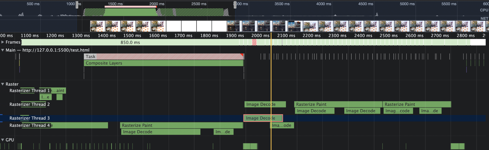
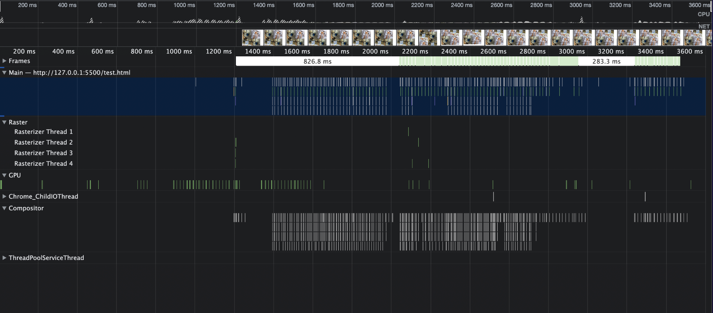

## 들어가며

이번 포스트에서는 탭 전환시 화면이 하얗게 되는 문제를 해결하기 위해 시도한 방법을 소개합니다.

## 문제 상황

MyPlace라는 개인 프로젝트를 만들면서 홈 화면에서 다른 페이지로 넘어갔다 돌아오는 경우 잠깐 하얀화면으로 변경되었다가 원래 화면이 보여지는 문제가 있었습니다. 또한 스크롤시에도 화면이 하얗게 변하는 문제가 있었습니다.

다행히 이 문제는 개발하면서 참고하였던 여러 레퍼런스때문에 많이 띄워진 크롬의 탭을 삭제하자 많이 완화되었지만 여전히 스크롤이 부드럽게 되지 않았습니다. 또한 다른 사이트들의경우 탭을 많이 띄워도 이러한 상황이 발생하지는 않았기에 이를 개선할 필요성을 느꼈습니다.

## 문제 원인

당시상황을 완벽하게 재현하지는 못하여서 탭 전환시 페이지 상단부터 발생하지는 않지만, 스크롤시 하얀 화면이 잠시 보이다가 사진이 렌더링 됩니다.

위 사진을 보면 이미지를 디코딩 하는데 많은 시간이 들어서 화면을 렌더링하는데 시간이 오래걸림을 알수 있습니다. 브라우저가 적절하게 레스터 스레드를 이용해 병렬처리를하지만, 이미지 디코딩을 하는데 거의 1.5초이상이 소모됨을 알 수 있습니다. 따라서 이미지를 최적화 해야한다는 사실을 인지하였습니다.

> 이미지 디코딩은 인코딩의 반대입니다. 이미지를 이진수로 표현된 데이터에서 원래그림으로 표기하는것을 말합니다.

## 이미지 최적화 하기

### 이미지 사이즈를 적절한 크기로 줄이기

이미지를 디코딩하는데 오랜시간이 걸리므로, 이미지의 용량을 줄이면 될것으로 생각하였습니다. 위 이미지는 경우에따라 다르지만 대략 4000 _ 4000 정도의 사이즈로 최대 10mb정도의 사이즈를 가지는 이미지들입니다. 따라서 이 이미지를 500 _ 500 사이즈의 상자에 렌더링 할것이기에 레티나 디스플레이를 감안하여 1000 \* 1000 정도의 사이즈로 줄이면 위 문제는 해결할수 있습니다. 
위사진을 보면 앞선 사진에서 있었던 이미지를 디코딩 하는 시간이 더이상 보이지 않는것을 알수있습니다. 이미지를 50kb내외로 줄였기 때문에 너무 작은 시간동안 디코딩이 이루어져서 잘보이지 않는것입니다.

> 이미지를 리사이징 해서 가져올수 없는 경우 CDN서버를 통해서 리사이징된 이미지를 요청해야합니다. 대표적으로 cloudfront 서비스가 있습니다.

### 이미지 CDN 사용하기

이미지 CDN을 사용하면 이미지 다운로드 속도를 40%~80%로 줄일 수 있습니다. 또한 삭제하기 쉽지는 않지만, CDN을 사용하게 되면 HTTP 캐시를 이용하여 이미지 캐싱이 가능해지게 됩니다. 또한 이미지 CDN의 주요 기능이 이미지 리사이징이기 때문에, 이미지 저장방식에따라 이미지 사이즈를 줄일수 없는경우 CDN을 사용해 리사이징을 시도할수 있습니다. 제가 사진을 저장하기위해 이용하는 cloudinary는 리사이징 및 cdn 기능을 제공하기에 그대로 사용하였습니다.

### 이미지 확장자를 적절하게 사용하기

이미지를 처리하는 대표적인 확장자는 jpg, png입니다. 하지만 웹용으로는 webp라는 확장자가 제공되고 있습니다. 같은 이미지 사이즈 기준 용량이 20% 정도 작습니다. 물론 jpg 와 png보다 약간 흐리다고는 하지만, 개인적으로는 큰차이를 알수는 없었습니다. 다만 이 프로젝트에서는 사진을 유저가 업로드 하기에 webp 파일을 강요할수는 없어 채택하지는 못했습니다.

## 이미지 다운로드 시간 감소

이미지 사이즈를 줄여 깜빡임 현상을 해결하였습니다. 그런데 부가적으로 초기 로드시간도 크게 개선할수 있었습니다. 네트워크 상태에 따라 다르겠지만, 적어도 1초 이상은 줄어든것으로 측정되었습니다. 이는 기존에 요청하는 용량의 1% 정도의 이미지를 요청했기 때문이었습니다. 이러한 결과도 확인하고 나니 확실히 처음에 로드하던 이미지 사이즈가 불필요하게 크다는걸 알수 있었습니다.

## 마치며

이번 포스트에서는 이미지와 관련된 렌더링 이슈를 분석하고 이를 해결해보았습니다. 저는 레퍼런스를 참고하느라 많은 탭을 유지하였지만, 사실 탭을 30~50개씩 유지하는것이 일반적인 상황은 아닙니다. 하지만 일반적이지 않은 상황에서 사용하는 사람이 있을수 있고, 이러한 선택이 일반적인 사용자의 경험을 저해하는것이 아니라면 개선하는것이 좋다고 생각합니다.

## 참고자료

<a class="link" href="https://oliveyoung.tech/blog/2021-11-22/How-to-Improve-Web-Performance-with-Image-Optimization/">웹사이트 최적화 방법 - 이미지 파트</a>
<a class="link" href="https://kinsta.com/blog/optimize-images-for-web/">How To Optimize Images for Web and Performance</a>
