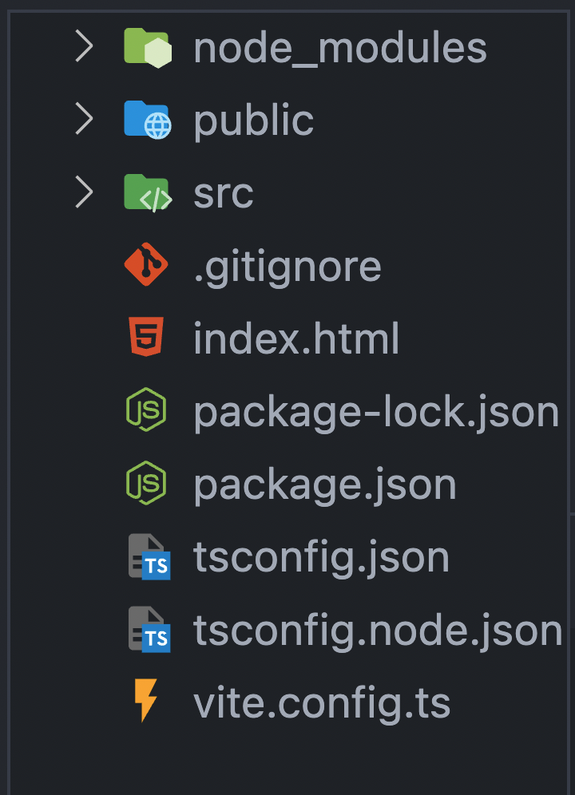
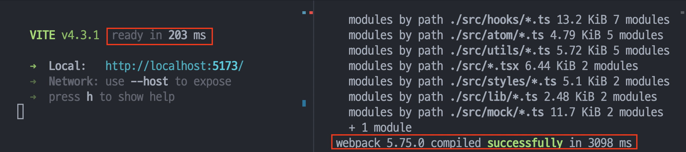

## 들어가며

토이 프로젝트로 진행중인 프로젝트에서 Webpack 과 Babel을 이용해 개발환경을 직접 구성해 React 기반의 프로젝트를 진행하고 있었습니다.

개발이 거의 마무리 단계이지만, 지속적으로 수정사항이 발생하였고 특히 UI상으로 디자인을 세밀하게 고치는 문제로 인해 자주 css를 변경하는 경우가 많았습니다.

이러한 상황에서 많은 요소를 한번에 변경하거나 큰 컴포넌트에서 변경을 진행할경우 갱신되는데 약간의 딜레이가 발생했을뿐만아니라 초기 개발서버를 빌드하는데도 약간의 시간이 소모되었습니다.

따라서 Webpack 기반의 프로젝트를 Vite 기반으로 마이그레이션 하게되었습니다. 이번포스트에서는 일반적인 마이그레이션 과정과 진행하면서 겪었던 문제들에 대해서 이야기해봅니다.

## Vite 이해하기

마이그레이션 과정을 설명하기에 앞서서 Vite라는 도구에 대해서 간략하게 설명해보고자합니다.

### webpack의 문제점

Webpack은 브라우저의 모듈문제와, 모듈을 여러번 요청해야하는 문제를 해결해주는 모듈 번들러로서의 역할과 HMR, Tree shaking등 편리한 개발환경을 제공하는 도구였습니다.

하지만 Webpack에 큰 단점이었는데 바로 속도가 느리다는것입니다. 프로젝트 규모가 커지면 커질수록 개발 서버의 HMR 속도가 느려지고, 빌드 속도또한 느려지면서 개발자 생산성을 저하시키거나 비용을 증가시키게 되었습니다.

### esBuild의 등장

이로인해 go라는 네이티브 언어로 작성된 esBuild가 등장합니다. 벤치마크상으로는 webpack보다 100배 빠르다고 합니다. 하지만 webpack은 단순한 빌드도구가 아닌 개발 환경도구였습니다. 따라서 개발환경에서 편리한 기능을 제공하지 않는 esBuild가 webpack을 대체하기에는 아쉬운점이 많았습니다.

### esBuild를 포함한 snowpack의 등장

이후 등장한 도구가 바로 snowpack입니다. snowpack은 빌드도구로써의 esBuild의 장점을 채택하기 위해서 빌드시에는 esBuild를 활용하지만 번들링을 하여 브라우저에 배포할때는 webpack과 같은 기존의 번들러를 그대로 이용하면서 성능과 사용성 두가지를 모두 챙기게됩니다.

특히 개발서버에서는 모든 파일을 빌드하지 않고 변경된 파일만 새로 빌드함으로써 속도를 챙길수 있었습니다.

### snowpack을 계승한 vite

snowpack의 아이디어를 대부분 가져와 더욱 실용성을 높여 구현한 것이 바로 vite 입니다. vite도 마찬가지로 개발환경과 배포환경에서의 방식이 다릅니다.

#### 개발환경

vite는 개발환경의 모듈을 크게 Dependencies와 Source code로 구분합니다.

Dependencies의 경우 우리가 의존성으로 설치하는 모듈에 해당되며 이는 개발도중 변경되지 않기 때문에 esBuild를 활용해서 미리 빠르게 빌드합니다.

Source code의 경우 우리가 작성하는 react 컴포넌트 같은 코드로 변경될 가능성이 있기때문에 ESM(javascript 공식 모듈) 방식으로 제공합니다. 따라서 어떤 모듈이 수정되면 vite는 그저 수정된 모듈과 관련된 부분만을 교체할 뿐이고, 브라우저에서 해당 모듈을 요청하면 교체된 모듈을 전달할 뿐입니다

위 두가지 기법을 사용하기 때문에 vite는 기존방식과 다르게 hmr이 굉장히 빠릅니다. 공식문서 맨 앞에서 장점으로 소개할 수 있을정도의 속도를 보여줍니다.

> vite에서 HMR의 동작 원리에 대해서 보다 깊이있는 이해가 필요하시면 아래 포스트를 참고해보세요
> https://velog.io/@woohm402/vite-react-hmr

#### 배포환경

최근 브라우저에서 ESM방식이 지원되지 않는곳은 많지 않지만(explore...) 만일 이 파일을 번들링(하나로 합치기)하지 않고 제공하게 되면 네트워크에 너무많은 요청을 하게 됩니다. 따라서 이를 하나로 합칠 필요가 있는데, esBuild는 여전히 프로덕션 환경에서의 안정성이 확보되지 않아서, Rollup을 사용햐고 있습니다.

공식문서 상으로는 언젠가 안정화된다면 esBuild로 넘어갈 가능성도 충분히 있다고 합니다.

## Vite 적용하기

### 환경 설정하기

빈 폴더에 아래 명령어를 입력해서 vite의 기본구조를 알아보겠습니다.

```
npm create vite@latest [프로젝트 명] --template react-ts
```


이미지 처럼 프로젝트가 구성되는데, 몇가지 특징들이 있기에, 이를 짚어보겠습니다.

- root에 index.html이 위치하고있습니다. 그리고 index.html에는 index.tsx 진입점이 포함되어야합니다.
- tsconfig.node.json이라는 파일은 vite의 typescript설정 즉 node.js환경의 설정입니다.
- vite.config.ts는 vite 설정파일입니다. defineConfig에는 함수나 객체를 전달할수 있습니다.

위 네가지를 잘 파악하면서 프로젝트로 옮기게 되면 vite로의 준비는 끝입니다. dev 나 build를 하면 결과물을 확인할수 있습니다. 아래에서는 프로젝트를 옮기면서 겪었던 문제나, 더 적용해보면 좋을만한 문제를 다루어 봅니다.

### 환경변수 적용하기

기존 webpack 기반의 프로젝트에서는 dotenv-webpack를 이용하여 환경변수를 process.env에 담아주었습니다. 하지만 Vite의 경우 prefix가 Vite로 되어있어야만 읽어들이며 import.meta.env에서 조회할수 있습니다.

하지만 기존의 process.env를 변경하고 접두어를 추가시키는것에 꽤많은 작업이 들어가고 과정에서 실수할 가능성이 높아보여서 변경하지 않고 그대로 적용할수 있는 플러그인을 사용하였습니다.

```
npm i vite-plugin-env-compatible -D

import { defineConfig } from "vite";
import react from "@vitejs/plugin-react-swc";
import envCompatible from "vite-plugin-env-compatible";

export default defineConfig({
  plugins: [react(), envCompatible({ prefix: "" })],
});
```

주의 할 점은 옵션의 prefix에 접두어를 넣어주어야 한다는점인데 만약 접두어가 없다면 ""를 넣어주어합니다. 접두어가 없다고해서 prefix를 아예 입력하지 않으면 환경변수가 반영되지 않습니다.

### babel프로젝트 사용하기

기존에 babel 기반의 프로젝트를 사용하고 있었다면 이를 적용시킬 방법이 있습니다. 저는 styled-compoenent의 요소를 정확하게 파악할수 있도록 해주는 babel-plugin-styled-components를 사용하고 있었는데, 아래와 같은 설정으로 플러그인을 추가하여 쉽게 사용할수 있었습니다.

```
import { defineConfig } from "vite";
import react from "@vitejs/plugin-react";

// https://vitejs.dev/config/
export default defineConfig({
  plugins: [
    react({
      babel: {
        plugins: [
          [
            "babel-plugin-styled-components",
            {
              displayName: true,
              fileName: false,
            },
          ],
        ],
      },
    }),
  ],
});

```

### SWC 사용해보기

개발환경에 한해서 SWC를 사용하여 빌드타임을 더욱 단축시킬수 있습니다. "@vitejs/plugin-react-swc를 다운받고, 이를 plugin에 적용시키면 됩니다. 경우에 따라 다를수는 있는데, 40퍼센트이상은 빨라진것을 확인할수 있습니다.

```
import { defineConfig } from "vite";
import react from "@vitejs/plugin-react-swc";

export default defineConfig({
  plugins: [react()],
});
```

다만 앞선 babel을 적용하는 방법을 찾지는 못해 실제 환경에서 사용할수는 없었습니다.

### typescript

vite의 타입스크립트 설정은 단순히 타입스크립트 파일을 자바스크립트 파일로 변경해주는것입니다. 따라서 타입오류를 검출할수 없는데, 이를 위해서는 tsc를 실행해 타입검사를 병행해야합니다. 초기 package.json의 build 명령어에도 tsc 가 명시되어있습니다.

```
"build": "tsc && vite build",
```

## 개선결과



위 이미지에서 볼수 있는것 처럼 개발 모드에서는 빌드 시작 시간이 3098ms -> 203ms 로 1/15로 줄어들었고 빌드 타임은 2877ms->2060ms로 30% 정도 감소하였습니다.

빌드 타임에 있어서는 큰 차이가 나는것은 아니지만, 1초가까이 차이가 나며 개발 환경에서는 엄청난 차이가 나기 때문에, 빌드시 오류나 예외가 고민된다면 개발환경에서만큼은 반드시 적용해보는것이 좋다고 생각합니다.

## 마치며

최근 들어서 빌드 환경에 대한 관심이 많이 늘고 있는것 같습니다. svelte와 같은 프레임워크도 빌드타임에 미리 변경사항을 계산해서 런타임 오버헤드를 줄이는 기술이고, css-in-js에서도 런타임 오버헤드를 줄이기위해서 빌드타임을 활용하는 vanilla-extract와 같은 zero-runtime css-in-js 라이브러리가 등장하는 상황입니다.

위 도구가 현재 주류는 아니지만, 사용사례가 많아진다면 빌드타임의 속도문제가 더욱 중요한 문제가 될 수 밖에 없을것같습니다. 이러한 상황에서 js가 아닌 rust나 go와 같은 네이티브 언어를 활용한 esbuild, snowpack, vite, SWC, turbopack과 같은 라이브러리들이 등장하여 webpack의 속도를 해결하려는 것이 위와 같이 런타임의 병목현상을 빌드타임에서 해결해보려는 노력의 일환이 아닐까 라는 생각을 가질수 있었습니다.

## 참고자료

<a class="link" href="https://engineering.ab180.co/stories/webpack-to-vite">Webpack → Vite: 번들러 마이그레이션 이야기</a>
<a class="link" href="https://tech.wonderwall.kr/articles/Vite/">
Webpack에서 Vite로 개발 환경 마이그레이션하기
</a>
<a class="link" href="https://vitejs-kr.github.io/guide/why.html">
Vite를 사용해야 하는 이유
</a>
<a class="link" href="https://yozm.wishket.com/magazine/detail/1620/">
Vite 이야기(feat. Svelte)
</a>
